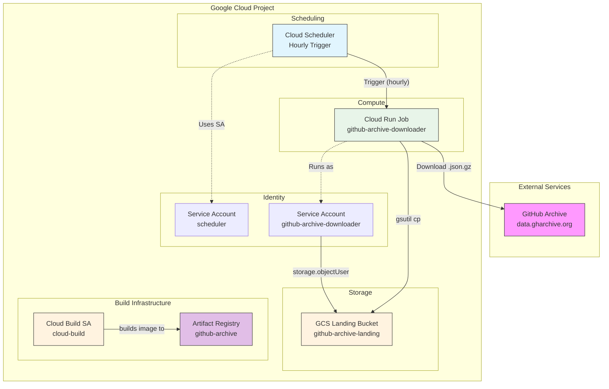
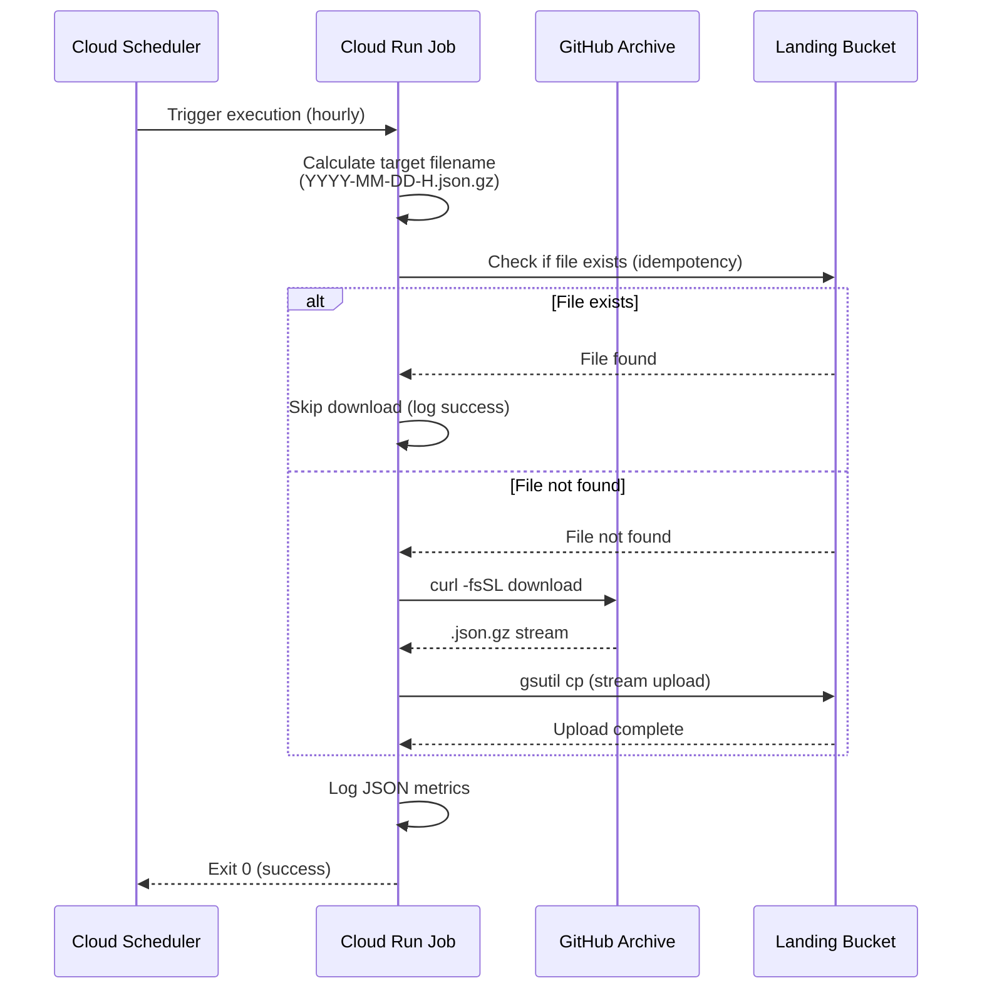

# Phase 1: GitHub Archive Ingestion Design

## Overview

Phase 1 implements the data ingestion layer that downloads hourly GitHub Archive files from the public data source (`data.gharchive.org`) and stores them in Google Cloud Storage for processing.

## Architecture



## Components

### 1. Cloud Run Job

| Property | Value | Notes |
|----------|-------|-------|
| **Name** | `{env}-github-archive-download-gsutil` | Environment-prefixed |
| **Base Image** | `gcr.io/google.com/cloudsdktool/google-cloud-cli:slim` | Includes gsutil |
| **Runtime** | Bash script | No application code |
| **Timeout** | 1800s (30 min) | Configurable up to 168 hours |
| **Region** | `us-central1` | Same as all other resources |
| **CPU** | 1 | |
| **Memory** | 512Mi | |

**Environment Variables:**
| Variable | Default | Description |
|----------|---------|-------------|
| `ENVIRONMENT` | `dev` | Environment (local/dev/prod) |
| `PROJECT_ID` | Auto-detected | GCP Project ID |
| `BUCKET_NAME` | Auto-derived | `{PROJECT_ID}-{ENV}-github-archive-landing` |
| `HOURS_AGO` | `1` | Hours ago to download |

### 2. Cloud Storage Bucket (Landing)

| Property | Value | Notes |
|----------|-------|-------|
| **Name** | `{project_id}-{env}-github-archive-landing` | Auto-derived naming |
| **Location** | `us-central1` | Regional |
| **Storage Class** | Standard | Default |
| **Path Structure** | `github-archive/raw/{YYYY-MM-DD-H}.json.gz` | Organized by source |

### 3. Cloud Scheduler

| Property | Value | Notes |
|----------|-------|-------|
| **Schedule** | `30 * * * *` | Hourly at 30 minutes past |
| **Target** | Cloud Run Job | HTTP trigger |
| **Time Zone** | UTC | GitHub Archive uses UTC |

## Data Flow



## File Naming Convention

GitHub Archive files follow this pattern:
- **Format**: `YYYY-MM-DD-H.json.gz`
- **Hour**: Single digit for 0-9 (NOT zero-padded)
- **Examples**: `2026-03-10-0.json.gz`, `2026-03-10-12.json.gz`

## Idempotency

The download script implements idempotency by:
1. Checking if file exists in GCS before downloading
2. Using `gsutil -q stat` for existence check
3. Skipping download if file already present
4. Logging skip reason as JSON for Cloud Logging

## Logging Format

All logs are JSON-formatted for Cloud Logging integration:

```json
{
  "level": "info",
  "timestamp": "2026-03-10T12:00:00Z",
  "message": "Download completed successfully",
  "action": "download_success",
  "environment": "dev",
  "filename": "2026-03-10-11.json.gz",
  "file_size": "12345678",
  "duration_seconds": "45"
}
```

## IAM Roles and Permissions

### Service Account: `{env}-github-archive-downloader`

| Role | Scope | Purpose |
|------|-------|---------|
| `roles/storage.objectUser` | Project | Read/write objects in GCS buckets |
| `roles/logging.logWriter` | Project | Write logs to Cloud Logging |

### Cloud Run Job Execution

| Principal | Role | Purpose |
|-----------|------|---------|
| Cloud Scheduler SA | `roles/run.invoker` | Trigger job execution |
| Terraform Deployer SA | `roles/iam.serviceAccountUser` | Act as downloader SA |

## Google Cloud Default Modifications

| Default | Modification | Reason |
|---------|--------------|--------|
| **Cloud Run timeout** | 1800s (30 min) | Sufficient for single file download |
| **gsutil streaming** | Direct pipe to GCS | Memory-efficient for large files |
| **File naming** | Non-padded hours | Matches GitHub Archive convention |

## Error Handling

| Error Type | Behavior | Retry |
|------------|----------|-------|
| Network failure | Exit 1, log error | Cloud Run retries (default 3) |
| File not found (404) | Exit 1, log error | No retry (file doesn't exist) |
| GCS upload failure | Exit 1, log error | Cloud Run retries |
| Permission denied | Exit 1, log error | No retry (configuration issue) |

## Configuration

### Environment-Specific Settings

| Setting | dev | prod |
|---------|-----|------|
| Project ID | `dev-dataprocessing-489305` | `{prod-project-id}` |
| Bucket | `{project}-dev-github-archive-landing` | `{project}-prod-github-archive-landing` |
| Force destroy | `true` | `false` |

## Deployment

Phase 1 is deployed as a single Terraform layer or via Cloud Build:

```bash
# Manual trigger
gcloud run jobs execute {env}-github-archive-downloader --region=us-central1

# Scheduled (automatic)
# Cloud Scheduler triggers hourly
```

## Monitoring

### Key Metrics

| Metric | Type | Alert Threshold |
|--------|------|-----------------|
| Job execution count | Counter | - |
| Job failure count | Counter | > 3 consecutive |
| Download duration | Histogram | > 5 minutes |
| File size | Gauge | - |

### Log-based Metrics

- `download_success` - Successful downloads
- `download_failed` - Failed downloads
- `download_skipped` - Skipped (file exists)

## Cost Considerations

| Resource | Pricing Model | Est. Monthly Cost |
|----------|---------------|-------------------|
| Cloud Run Jobs | Per execution | ~$0 (free tier) |
| Cloud Storage | Per GB stored | ~$0.02/GB |
| Cloud Scheduler | Free | $0 |
| Network Egress | Free (within GCP) | $0 |

## Security

### Network Security
- **Egress**: Public internet (data.gharchive.org)
- **Ingress**: None (Cloud Run Job)

### Data Security
- **Encryption at rest**: Google-managed keys (default)
- **Encryption in transit**: HTTPS/TLS

## Next Phase

Output files are written to:
- **Path**: `gs://{landing-bucket}/github-archive/raw/{YYYY-MM-DD-H}.json.gz`
- **Trigger**: Eventarc detects new files → Phase 2 processing

---

*Document generated from code analysis on 2026-03-10*
