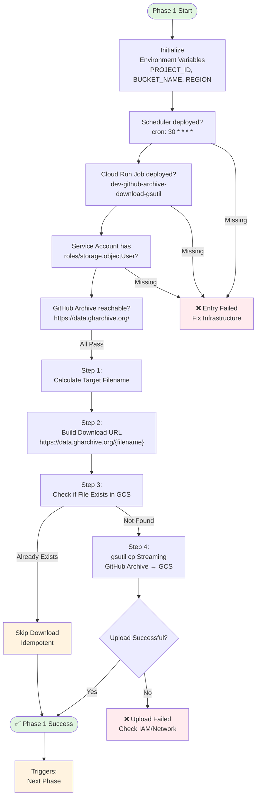

# Phase 1: Main Flow Diagram

**Note:** Using `gsutil cp` for streaming download (memory efficient ~50MB). Validation happens in Phase 2 (processing). Corrupted files from GitHub Archive will be detected during processing.
