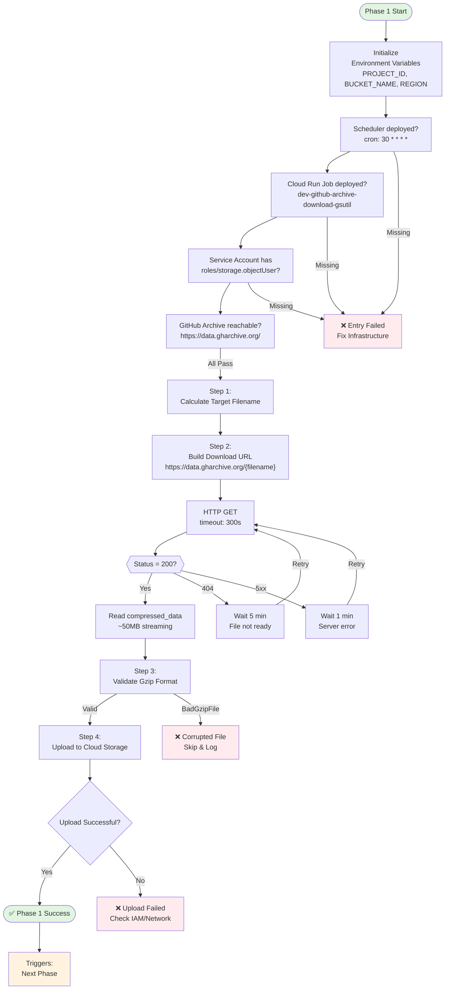

# Phase 1: Main Flow Diagram

```mermaid
graph TD
    Start([Phase 1 Start]) --> Init[Initialize<br>Environment Variables<br>PROJECT_ID, BUCKET_NAME, REGION]

    Init --> E1[Scheduler deployed?<br>cron: 30 * * * *]
    E1 --> E2[Cloud Run Job deployed?<br>dev-github-archive-download-gsutil]
    E2 --> E3[Service Account has<br>roles/storage.objectUser?]
    E3 --> E4[GitHub Archive reachable?<br>https://data.gharchive.org/]

    E4 -->|All Pass| CalcFilename[Step 1:<br>Calculate Target Filename]
    E1 -->|Missing| FailEntry[❌ Entry Failed<br>Fix Infrastructure]
    E2 -->|Missing| FailEntry
    E3 -->|Missing| FailEntry

    CalcFilename --> BuildURL["Step 2:<br>Build Download URL<br>https://data.gharchive.org/{filename}"]

    BuildURL --> HTTP[HTTP GET<br>timeout: 300s]
    HTTP --> CheckStatus{{Status = 200?}}

    CheckStatus -->|Yes| ReadData[Read compressed_data<br>~50MB streaming]
    CheckStatus -->|404| Wait404[Wait 5 min<br>File not ready]
    CheckStatus -->|5xx| Wait5xx[Wait 1 min<br>Server error]
    Wait404 -->|Retry| HTTP
    Wait5xx -->|Retry| HTTP

    ReadData --> ValidateGzip[Step 3:<br>Validate Gzip Format]

    ValidateGzip -->|Valid| UploadGCS[Step 4:<br>Upload to Cloud Storage]
    ValidateGzip -->|BadGzipFile| FailValidate[❌ Corrupted File<br>Skip & Log]

    UploadGCS --> Verify{Upload Successful?}
    Verify -->|Yes| Success([✅ Phase 1 Success])
    Verify -->|No| FailUpload[❌ Upload Failed<br>Check IAM/Network]

    Success --> Trigger[Triggers:<br>Next Phase]

    style Start fill:#e1f5e1
    style Success fill:#e1f5e1
    style FailEntry fill:#ffebee
    style FailValidate fill:#ffebee
    style FailUpload fill:#ffebee
    style Trigger fill:#fff3e0
```
