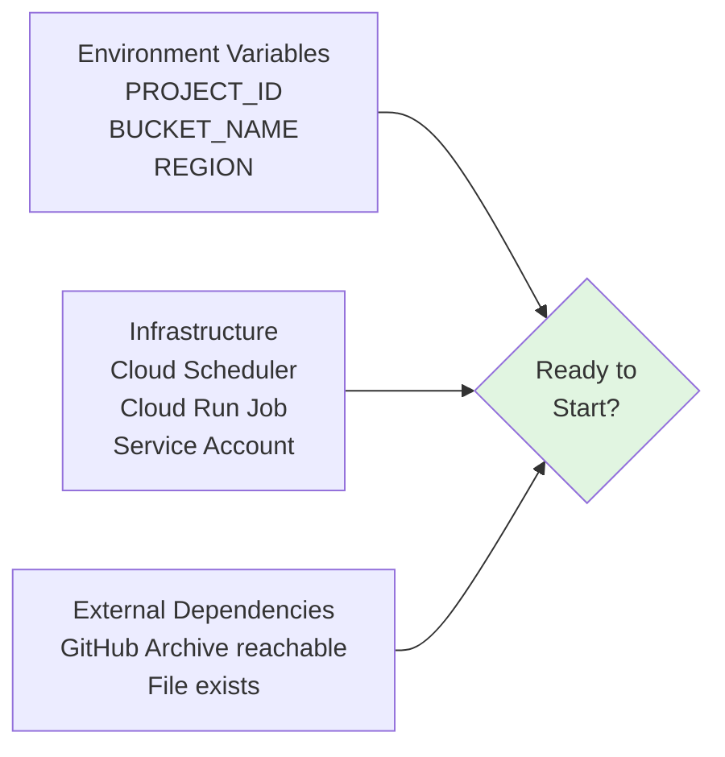

# Phase 1: Entry Conditions

```mermaid
flowchart LR
    Env[Environment Variables<br>PROJECT_ID<br>BUCKET_NAME<br>REGION]
    Infra[Infrastructure<br>Cloud Scheduler<br>Cloud Run Job<br>Service Account]
    External[External Dependencies<br>GitHub Archive reachable<br>File exists]

    Env --> Ready{Ready to<br>Start?}
    Infra --> Ready
    External --> Ready

    style Ready fill:#e1f5e1
```
