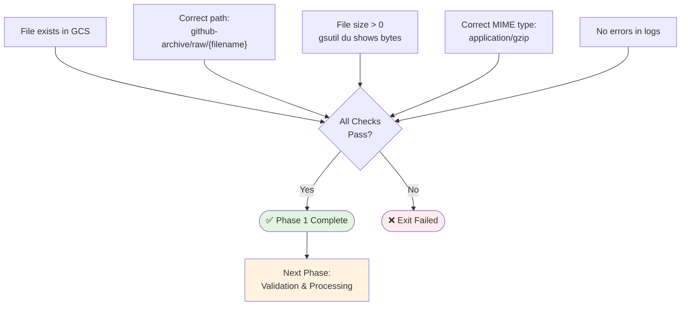

# Phase 1: Exit Conditions

```mermaid
flowchart TD
    EC1[File exists in GCS]
    EC2["Correct path:<br>github-archive/raw/{filename}"]
    EC3[File size > 0<br>gsutil du shows bytes]
    EC4[Correct MIME type:<br>application/gzip]
    EC5[No errors in logs]

    EC1 --> AllCheck{All Checks<br>Pass?}
    EC2 --> AllCheck
    EC3 --> AllCheck
    EC4 --> AllCheck
    EC5 --> AllCheck

    AllCheck -->|Yes| Success([✅ Phase 1 Complete])
    AllCheck -->|No| Fail([❌ Exit Failed])

    Success --> Next[Next Phase:<br>Validation & Processing]

    style Success fill:#e1f5e1
    style Fail fill:#ffebee
    style Next fill:#fff3e0
```

**Note:** Gzip validation happens in Phase 2 during processing. Phase 1 only ensures the file was successfully downloaded from GitHub Archive and landed in GCS.
