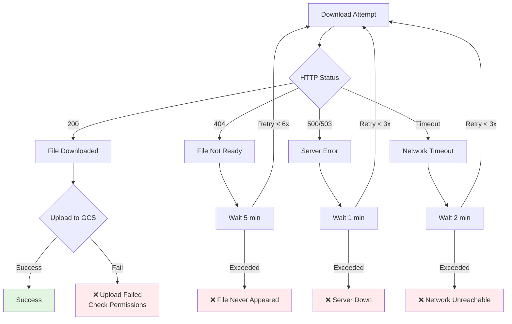

# Phase 1: Failure Scenarios

```mermaid
flowchart TD
    DownloadAttempt[Download Attempt] --> Status{HTTP Status}

    Status -->|200| ValidFile[File Downloaded]
    Status -->|404| FileNotReady[File Not Ready]
    Status -->|500/503| ServerError[Server Error]
    Status -->|Timeout| NetworkError[Network Timeout]

    FileNotReady --> Wait5[Wait 5 min]
    ServerError --> Wait1[Wait 1 min]
    NetworkError --> Wait2[Wait 2 min]

    ValidFile --> Upload{Upload to GCS}
    Upload -->|Success| Success
    Upload -->|Fail| FailUpload[❌ Upload Failed<br>Check Permissions]

    Wait5 -->|Retry < 6x| DownloadAttempt
    Wait1 -->|Retry < 3x| DownloadAttempt
    Wait2 -->|Retry < 3x| DownloadAttempt

    Wait5 -->|Exceeded| Fail404[❌ File Never Appeared]
    Wait1 -->|Exceeded| FailServer[❌ Server Down]
    Wait2 -->|Exceeded| FailNetwork[❌ Network Unreachable]

    style Success fill:#e1f5e1
    style FailUpload fill:#ffebee
    style Fail404 fill:#ffebee
    style FailServer fill:#ffebee
    style FailNetwork fill:#ffebee
```

**Note:** Corrupted file detection happens in Phase 2 during processing. Phase 1 only handles download and upload failures.
