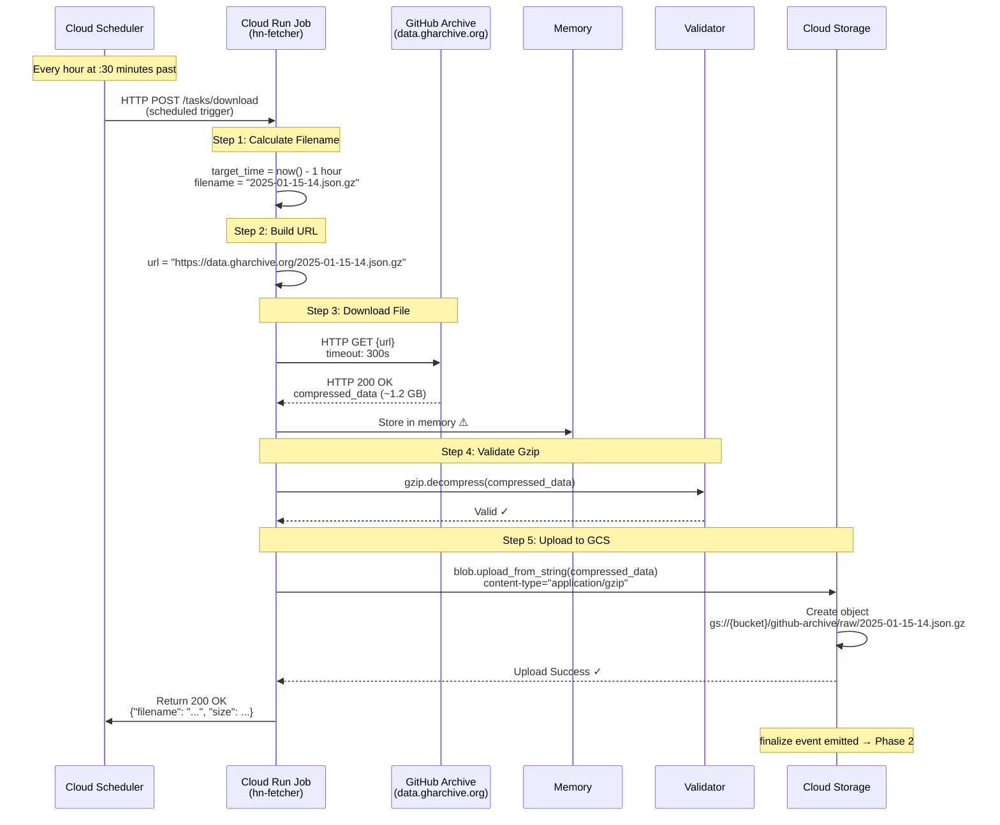

# Phase 1: Data Flow Sequence Diagram

```mermaid
sequenceDiagram
    participant S as Cloud Scheduler
    participant J as Cloud Run Job<br>(hn-fetcher)
    participant G as GitHub Archive<br>(data.gharchive.org)
    participant M as Memory
    participant V as Validator
    participant B as Cloud Storage

    Note over S: Every hour at :30 minutes past
    S->>J: HTTP POST /tasks/download<br>(scheduled trigger)

    Note over J: Step 1: Calculate Filename
    J->>J: target_time = now() - 1 hour<br>filename = "2025-01-15-14.json.gz"

    Note over J: Step 2: Build URL
    J->>J: url = "https://data.gharchive.org/2025-01-15-14.json.gz"

    Note over J, G: Step 3: Download File
    J->>G: HTTP GET {url}<br>timeout: 300s
    G-->>J: HTTP 200 OK<br>compressed_data (~1.2 GB)
    J->>M: Store in memory ⚠️

    Note over J, V: Step 4: Validate Gzip
    J->>V: gzip.decompress(compressed_data)
    V-->>J: Valid ✓

    Note over J, B: Step 5: Upload to GCS
    J->>B: blob.upload_from_string(compressed_data)<br>content-type="application/gzip"
    B->>B: Create object<br>gs://{bucket}/github-archive/raw/2025-01-15-14.json.gz
    B-->>J: Upload Success ✓

    J->>S: Return 200 OK<br>{"filename": "...", "size": ...}

    Note over B: finalize event emitted → Phase 2
```
