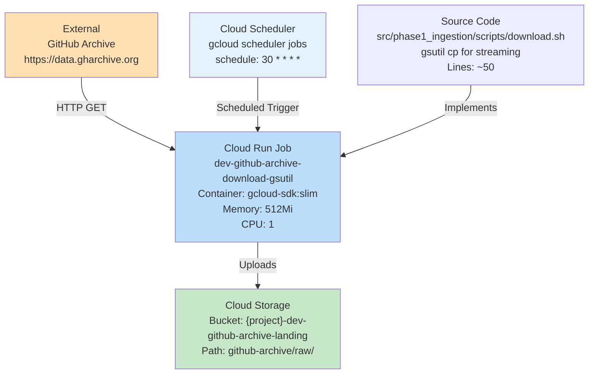

# Phase 1: Component View

```mermaid
flowchart TB
    Scheduler[Cloud Scheduler<br>gcloud scheduler jobs<br>schedule: 30 * * * *]

    Job[Cloud Run Job<br>dev-github-archive-download-gsutil<br>Container: gcloud-sdk:slim<br>Memory: 512Mi<br>CPU: 1]

    Code[Source Code<br>src/phase1_ingestion/scripts/download.sh<br>gsutil cp for streaming<br>Lines: ~50]

    Storage["Cloud Storage<br>Bucket: {project}-dev-github-archive-landing<br>Path: github-archive/raw/"]

    External[External<br>GitHub Archive<br>https://data.gharchive.org]

    External -->|HTTP GET| Job
    Scheduler -->|Scheduled Trigger| Job
    Job -->|Uploads| Storage
    Code -->|Implements| Job

    style Scheduler fill:#e3f2fd
    style Job fill:#bbdefb
    style Storage fill:#c8e6c9
    style External fill:#ffe0b2
```
