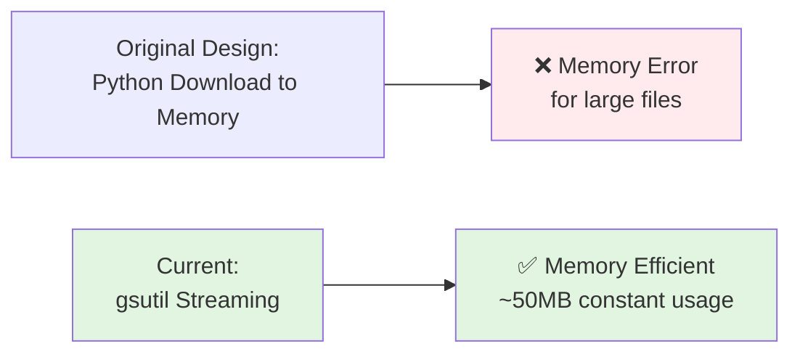

# Phase 1: Implementation Status

**Status:** ✅ **Already implemented** - Using `curl | gsutil cp -` for streaming downloads. No memory issues even with 1.2GB files.

**Trade-off:** No gzip validation in Phase 1 (happens in Phase 2 processing).
