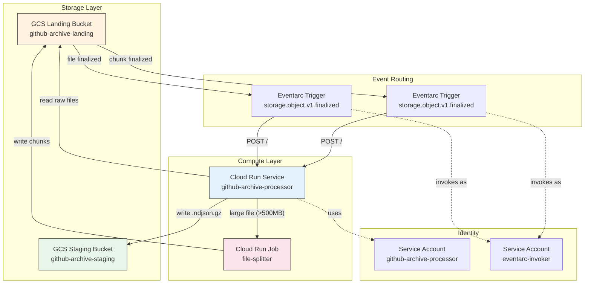
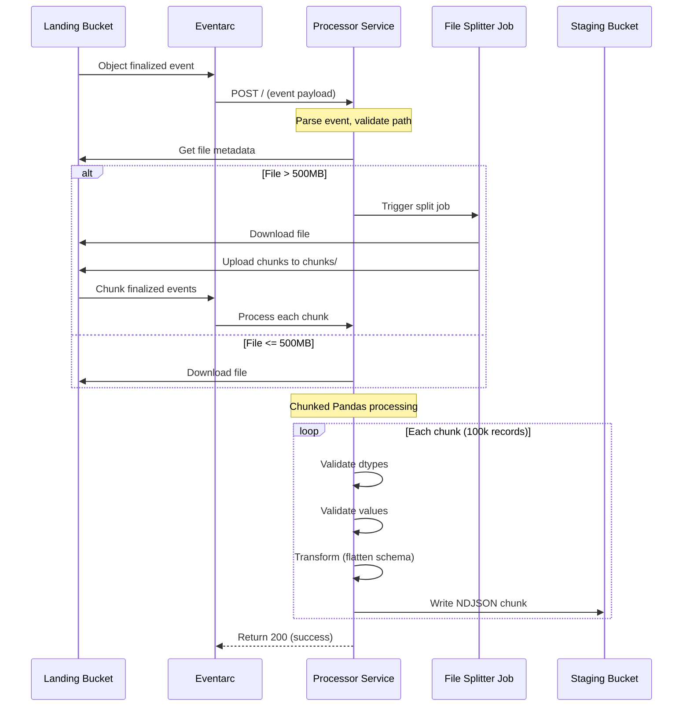

# Phase 2: GitHub Archive Processing Design

## Overview

Phase 2 implements the data transformation layer that processes raw GitHub Archive files from the landing bucket, validates and transforms the data, and writes processed NDJSON files to the staging bucket for BigQuery loading.

## Architecture



## Data Flow

```mermaid
flowchart LR
    subgraph Input["Input"]
        R1[raw/2026-03-10-12.json.gz<br/>~2GB compressed]
        R2[raw/2026-03-10-13.json.gz<br/>~50MB compressed]
    end

    subgraph Decision{"Size Check"}
        D1{> 500MB?}
    end

    subgraph Split["File Splitter"]
        S1[Chunk 1<br/>~50MB]
        S2[Chunk 2<br/>~50MB]
        S3[Chunk N<br/>~50MB]
    end

    subgraph Process["Processor"]
        P1[Validate]
        P2[Transform]
        P3[Write NDJSON]
    end

    subgraph Output["Output"]
        O1[processed/2026-03-10-12.ndjson.gz]
        O2[processed/2026-03-10-13.ndjson.gz]
    end

    R1 --> D1
    R2 --> D1
    D1 -->|"Yes"| Split
    D1 -->|"No"| Process
    Split --> Process
    Process --> Output

    style R1 fill:#ffcdd2,stroke:#333
    style R2 fill:#c8e6c9,stroke:#333
    style O1 fill:#e8f5e9,stroke:#333
    style O2 fill:#e8f5e9,stroke:#333
```

## Components

### 1. Cloud Run Service (Processor)

| Property | Deployed Value | Notes |
|----------|----------------|-------|
| **Name** | `dev-github-archive-processor` | Environment-prefixed |
| **Image** | Custom Python container | gunicorn + Flask |
| **Memory** | 4GiB | Handles large files |
| **CPU** | 2 | Parallel processing |
| **Timeout** | 3600s (1 hour) | Long-running processing |
| **Max Instances** | 5 | Concurrency control |
| **Concurrency** | 10 | Per-instance |
| **Region** | `us-central1` | Same as all resources |

**Environment Variables:**
| Variable | Value | Description |
|----------|-------|-------------|
| `PROJECT_ID` | `dev-dataprocessing-489305` | GCP Project ID |
| `LANDING_BUCKET` | `dev-dataprocessing-489305-dev-github-archive-landing` | Input bucket |
| `STAGING_BUCKET` | `dev-dataprocessing-489305-dev-github-archive-staging` | Output bucket |
| `CHUNKSIZE` | `100000` | Pandas chunk size |
| `FILE_SIZE_THRESHOLD_MB` | `500` | Large file threshold |

**Service Account:** `dev-github-archive-processor@dev-dataprocessing-489305.iam.gserviceaccount.com`

### 2. Cloud Run Job (File Splitter)

| Property | Value | Notes |
|----------|-------|-------|
| **Name** | `{env}-file-splitter` | Environment-prefixed |
| **Trigger** | On-demand from processor | Via Cloud Run API |
| **Chunk Size** | 10,000 lines | Configurable |
| **Target Chunk Size** | ~50MB | Approximate |

### 3. Cloud Storage Buckets

#### Landing Bucket (Input)
| Property | Value |
|----------|-------|
| **Name** | `{project}-{env}-github-archive-landing` |
| **Location** | `us-central1` |
| **Paths** | `github-archive/raw/`, `github-archive/chunks/` |

#### Staging Bucket (Output)
| Property | Value |
|----------|-------|
| **Name** | `{project}-{env}-github-archive-staging` |
| **Location** | `us-central1` |
| **Path** | `processed/` |

### 4. Eventarc Triggers

| Trigger | Event Type | Filter | Destination |
|---------|------------|--------|-------------|
| `dev-github-archive-storage` | `google.cloud.storage.object.v1.finalized` | Landing bucket | Processor service |
| (Split chunks) | `google.cloud.storage.object.v1.finalized` | Landing bucket chunks/ | Processor service |

## Processing Pipeline



## Code Architecture

### Module Structure

```
src/github_archive/phase2_process_files/
├── main.py                    # Flask entry point, Eventarc handler
├── processors/
│   ├── file_processor.py      # Main processing logic
│   ├── file_splitter.py       # Large file splitting
│   └── transformer.py         # Schema flattening
├── validators/
│   ├── file_validator.py      # File name/size validation
│   ├── dtype_validator.py     # Data type validation
│   └── value_validator.py     # Value range validation
├── writers/
│   └── ndjson_writer.py       # GCS NDJSON writer
├── utils/
│   ├── gcs_client.py          # GCS utilities
│   └── logger.py              # Structured logging
└── schemas/
    └── dtype_definitions.py   # Schema definitions
```

### Key Classes

| Class | File | Purpose |
|-------|------|---------|
| `GitHubArchiveFileProcessor` | `file_processor.py` | Main orchestrator |
| `GitHubArchiveFileSplitter` | `file_splitter.py` | Large file handling |
| `GitHubEventTransformer` | `transformer.py` | Schema flattening |
| `DtypeValidator` | `dtype_validator.py` | Type coercion |
| `ValueValidator` | `value_validator.py` | Business rules |
| `GCSNDJSONWriter` | `ndjson_writer.py` | Streaming writes |

## Schema Transformation

### Input Schema (GitHub Archive)

```json
{
  "id": "12345",
  "type": "PushEvent",
  "created_at": "2026-03-10T12:00:00Z",
  "actor": {
    "id": 123,
    "login": "username",
    "display_login": "Username",
    "avatar_url": "https://...",
    "gravatar_id": "",
    "url": "https://api.github.com/users/username",
    "site_admin": false
  },
  "repo": {
    "id": 456,
    "name": "owner/repo",
    "url": "https://api.github.com/repos/owner/repo"
  },
  "payload": { ... }
}
```

### Output Schema (Flattened)

| Field | Type | Source |
|-------|------|--------|
| `event_id` | STRING | `id` |
| `event_type` | STRING | `type` |
| `created_at` | TIMESTAMP | `created_at` |
| `actor_id` | INT64 | `actor.id` |
| `actor_login` | STRING | `actor.login` |
| `actor_display_login` | STRING | `actor.display_login` |
| `actor_avatar_url` | STRING | `actor.avatar_url` |
| `actor_gravatar_id` | STRING | `actor.gravatar_id` |
| `actor_url` | STRING | `actor.url` |
| `actor_site_admin` | BOOL | `actor.site_admin` |
| `repo_id` | INT64 | `repo.id` |
| `repo_name` | STRING | `repo.name` |
| `repo_url` | STRING | `repo.url` |
| `payload_*` | Various | `payload.*` (selected fields) |
| `etl_create_ts` | TIMESTAMP | Processing timestamp |
| `etl_create_id` | STRING | `"GITHUB_PROCESSOR"` |

## Validation Rules

### File Validation

| Check | Rule | Error |
|-------|------|-------|
| Extension | Must be `.json.gz` | Reject |
| Filename pattern | `YYYY-MM-DD-H.json.gz` | Reject |
| Year range | 2011-2100 | Reject |
| Month range | 1-12 | Reject |
| Day range | 1-31 | Reject |
| Hour range | 0-23 | Reject |
| File size | < 10GB | Reject |
| File size | > 100 bytes | Reject |
| File size | >= 500MB | Split |

### Data Validation

| Field | Validation | Handling |
|-------|------------|----------|
| `event_id` | Non-null string | Drop row |
| `event_type` | Known event type | Keep (with warning) |
| `created_at` | ISO 8601 format | Coerce to timestamp |
| `actor_id` | Integer | Coerce to Int64 |
| `repo_id` | Integer | Coerce to Int64 |

## IAM Roles and Permissions

### Service Account: `{env}-github-archive-processor`

| Role | Scope | Purpose |
|------|-------|---------|
| `roles/storage.objectViewer` | Landing bucket | Read input files |
| `roles/storage.objectCreator` | Staging bucket | Write output files |
| `roles/logging.logWriter` | Project | Structured logging |
| `roles/errorreporting.writer` | Project | Error reporting |
| `roles/run.invoker` | Project | Trigger splitter job |

### Service Account: `{env}-eventarc-invoker`

| Role | Scope | Purpose |
|------|-------|---------|
| `roles/eventarc.eventReceiver` | Project | Receive events |
| `roles/run.invoker` | Processor service | Invoke service |
| `roles/logging.logWriter` | Project | Logging |

## Google Cloud Default Modifications

| Default | Modification | Reason |
|---------|--------------|--------|
| **Cloud Run timeout** | 3600s (vs default 300s) | Large file processing |
| **Memory** | 4GiB (vs default 512MiB) | Pandas chunk processing |
| **Concurrency** | 10 (vs default 80) | Memory constraints |
| **Max instances** | 5 (vs unlimited) | Cost control |
| **Ingress** | Internal only | Security |
| **Authentication** | Required | Eventarc requirement |

## Error Handling

### HTTP Response Codes

| Code | Condition | Action |
|------|-----------|--------|
| 200 | Success | Normal completion |
| 200 | Ignored (wrong path) | Log and acknowledge |
| 207 | Partial success | Some records failed |
| 400 | Invalid event | Log and reject |
| 500 | Processing error | Retry by Eventarc |

### Retry Policy

- **Eventarc**: `RETRY_POLICY_RETRY` (exponential backoff)
- **Cloud Run**: 3 retries by default
- **Max retry duration**: 7 days (Eventarc default)

## Monitoring

### Key Metrics

| Metric | Type | Alert |
|--------|------|-------|
| Request count | Counter | - |
| Request latency | Histogram | > 5 min |
| Error count | Counter | > 5/hour |
| Memory utilization | Gauge | > 80% |
| Records processed | Counter | - |

### Logging

All logs use structured JSON format:
```json
{
  "timestamp": "2026-03-10T12:00:00Z",
  "severity": "INFO",
  "component": "phase2-processor",
  "message": "File processing completed",
  "file_name": "2026-03-10-12.json.gz",
  "records_in": 150000,
  "records_out": 149850,
  "errors": 150,
  "duration_seconds": 45.2
}
```

## Deployment

### Cloud Build

```bash
# Deploy via Cloud Build
gcloud builds submit \
  --config=src/github_archive/phase2_process_files/cloudbuild.yaml \
  --substitutions=_REGION=us-central1,_ENVIRONMENT=dev
```

### Manual Deployment

```bash
# Build and deploy
gcloud run deploy dev-github-archive-processor \
  --source=src/github_archive/phase2_process_files \
  --region=us-central1 \
  --memory=4Gi \
  --cpu=2 \
  --timeout=3600 \
  --max-instances=5 \
  --concurrency=10 \
  --no-allow-unauthenticated
```

## Cost Considerations

| Resource | Pricing | Est. Monthly |
|----------|---------|--------------|
| Cloud Run (requests) | $0.40/million | ~$1 |
| Cloud Run (compute) | $0.00002400/vCPU-sec | ~$50 |
| Cloud Storage | $0.02/GB | ~$20 |
| Eventarc | Free | $0 |

## Security

### Network
- **Ingress**: Internal only (`ALLOW_INTERNAL_ONLY`)
- **Egress**: GCS APIs only

### Authentication
- **Service-to-service**: IAM authentication
- **No public access**: Authentication required

## Next Phase

Output files are written to:
- **Path**: `gs://{staging-bucket}/processed/{YYYY-MM-DD-H}.ndjson.gz`
- **Trigger**: Eventarc detects new files → Phase 3 BigQuery loading

---

*Document generated from code analysis on 2026-03-10*
