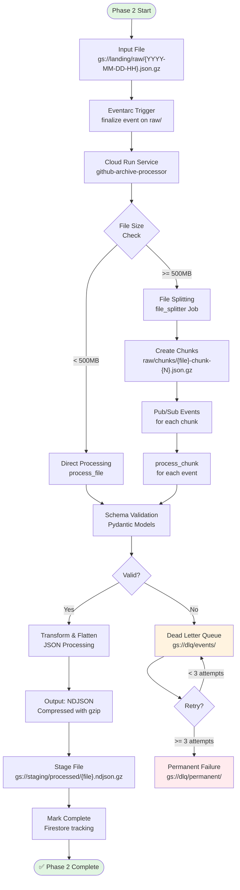

# Phase 2: Main Flow Diagram

```mermaid
graph TD
    Start([Phase 2 Start]) --> Input["Input File<br>gs://landing/raw/{YYYY-MM-DD-HH}.json.gz"]

    Input --> EventArc[Eventarc Trigger<br>finalize event on raw/]

    EventArc --> CR[Cloud Run Service<br>github-archive-processor]

    CR --> SizeCheck{File Size<br>Check}

    SizeCheck -->|< 500MB| Direct[Direct Processing<br>process_file]
    SizeCheck -->|>= 500MB| Split[File Splitting<br>file_splitter Job]

    Split --> Chunks["Create Chunks<br>raw/chunks/{file}-chunk-{N}.json.gz"]
    Chunks --> ChunkEvents[Pub/Sub Events<br>for each chunk]
    ChunkEvents --> ChunkProcess[process_chunk<br>for each event]

    Direct --> Validate[Schema Validation<br>Pydantic Models]
    ChunkProcess --> Validate

    Validate --> Valid{Valid?}
    Valid -->|Yes| Transform[Transform & Flatten<br>JSON Processing]
    Valid -->|No| DLQ[Dead Letter Queue<br>gs://dlq/events/]

    Transform --> Output[Output: NDJSON<br>Compressed with gzip]
    Output --> Stage["Stage File<br>gs://staging/processed/{file}.ndjson.gz"]

    Stage --> Complete[Mark Complete<br>Firestore tracking]
    Complete --> Success([✅ Phase 2 Complete])

    DLQ --> Retry{Retry?}
    Retry -->|< 3 attempts| DLQ
    Retry -->|>= 3 attempts| Permanent[Permanent Failure<br>gs://dlq/permanent/]

    style Start fill:#e1f5e1
    style Success fill:#e1f5e1
    style DLQ fill:#fff3e0
    style Permanent fill:#ffebee
```

**Note:** Phase 2 processes files from Phase 1 landing zone and outputs to staging zone ready for BigQuery loading.
