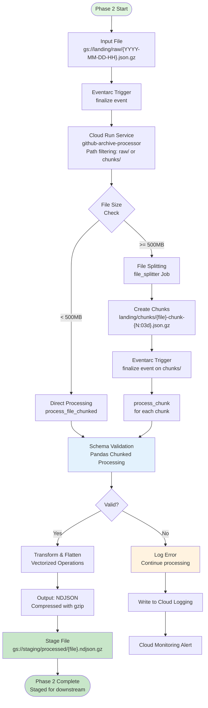

# Phase 2: Main Flow Diagram

**Note:** Phase 2 processes files from Phase 1 landing zone and outputs to staging zone in NDJSON format. Uses Pandas with chunked processing for memory-efficient validation. Uses **single Cloud Run service** with path filtering for both raw/ and chunks/ files - no Pub/Sub costs.
