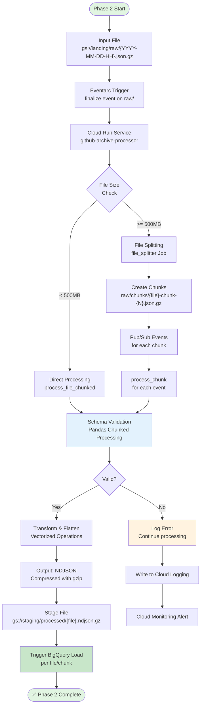

# Phase 2: Main Flow Diagram

**Note:** Phase 2 processes files from Phase 1 landing zone and outputs to staging zone ready for BigQuery loading. Uses Pandas with chunked processing for memory-efficient validation. Each file/chunk triggers BigQuery load immediately upon completion - no state tracking needed.
