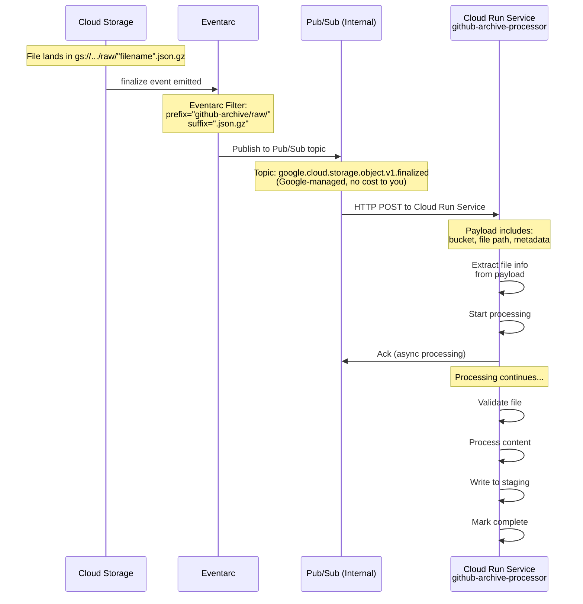

# Phase 2: Eventarc Trigger Configuration



**Key Point:** The Pub/Sub shown here is **Google's internal infrastructure** - managed automatically by Cloud Storage and Eventarc. You don't create or pay for this Pub/Sub topic.

## Two Eventarc Triggers

**Trigger #1: Main File Processor (raw/ folder)**

```hcl
resource "google_eventarc_trigger" "main_file_processor" {
  name        = "github-archive-main-file-processor"
  location    = var.region
  project     = var.project_id

  matching_criteria {
    attribute = "type"
    value     = "google.cloud.storage.object.v1.finalized"
  }

  matching_criteria {
    attribute = "bucket"
    value     = var.landing_bucket_name
  }

  matching_criteria {
    attribute = "name"
    value     = "github-archive/raw/*.json.gz"
  }

  destination {
    cloud_run_service {
      service = google_cloud_run_v2_service.processor.name
      region  = var.region
    }
  }

  service_account = google_service_account.eventarc_invoker.email
}
```

**Trigger #2: Chunk Processor (chunks/ folder)**

```hcl
resource "google_eventarc_trigger" "chunk_processor" {
  name        = "github-archive-chunk-processor"
  location    = var.region
  project     = var.project_id

  matching_criteria {
    attribute = "type"
    value     = "google.cloud.storage.object.v1.finalized"
  }

  matching_criteria {
    attribute = "bucket"
    value     = var.landing_bucket_name
  }

  matching_criteria {
    attribute = "name"
    value     = "github-archive/chunks/*.json.gz"
  }

  destination {
    cloud_run_service {
      service = google_cloud_run_v2_service.chunk_processor.name
      region  = var.region
    }
  }

  service_account = google_service_account.eventarc_invoker.email
}
```

**Key Points:**
- Two triggers filter by different path prefixes (raw/ vs chunks/)
- No user-managed Pub/Sub topics required
- Zero Pub/Sub costs
- Simple filename-based metadata encoding
