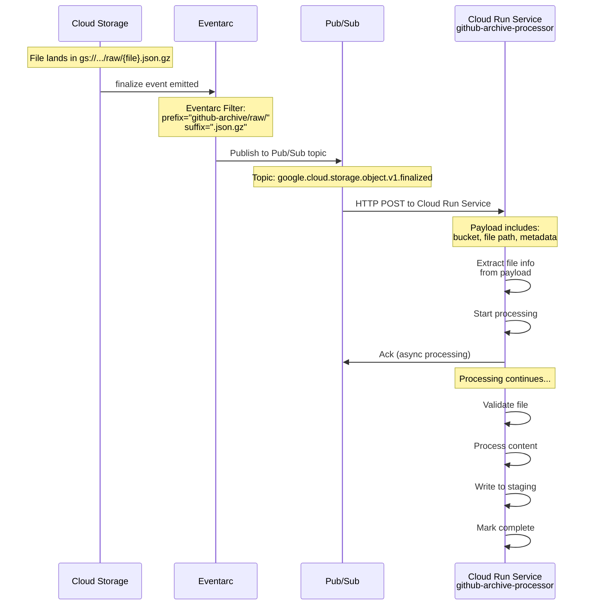

# Phase 2: Eventarc Trigger Configuration



**Eventarc Configuration:**

```hcl
resource "google_eventarc_trigger" "github_archive_processor" {
  name        = "github-archive-processor-trigger"
  location    = var.region
  project     = var.project_id

  matching_criteria {
    attribute = "type"
    value     = "google.cloud.storage.object.v1.finalized"
  }

  matching_criteria {
    attribute = "bucket"
    value     = google_storage_bucket.landing.name
  }

  matching_criteria {
    attribute = "name"
    value     = "github-archive/raw/*.json.gz"
  }

  destination {
    cloud_run_service {
      service = google_cloud_run_v2_service.github_archive_processor.name
      region  = var.region
    }
  }

  service_account = google_service_account.eventarc_invoker.email
}
```

**Key Points:**
- Eventarc filters by bucket prefix and suffix
- Triggers Cloud Run Service (autoscaling)
- Async processing - acknowledges immediately
- Retries on failure (exponential backoff)
