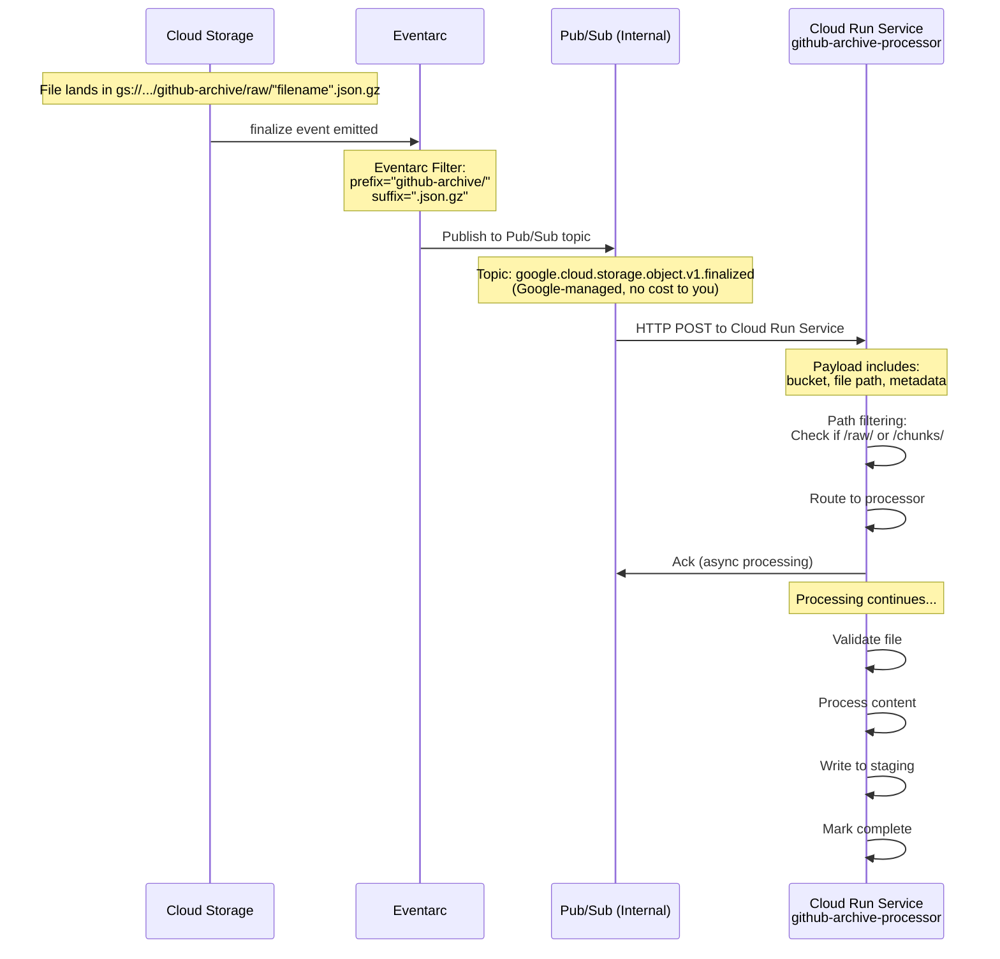

# Phase 2: Eventarc Trigger Configuration



**Key Point:** The Pub/Sub shown here is **Google's internal infrastructure** - managed automatically by Cloud Storage and Eventarc. You don't create or pay for this Pub/Sub topic.

## Eventarc Trigger (Single Service)

**Trigger: GitHub Archive Processor (handles both raw/ and chunks/)**

```hcl
resource "google_eventarc_trigger" "github_archive_processor" {
  name        = "github-archive-processor"
  location    = var.region
  project     = var.project_id

  matching_criteria {
    attribute = "type"
    value     = "google.cloud.storage.object.v1.finalized"
  }

  matching_criteria {
    attribute = "bucket"
    value     = var.landing_bucket_name
  }

  matching_criteria {
    attribute = "name"
    value     = "github-archive/*.json.gz"
  }

  destination {
    cloud_run_service {
      service = google_cloud_run_v2_service.processor.name
      region  = var.region
    }
  }

  service_account = google_service_account.eventarc_invoker.email
}
```

**Path Filtering in Code:**

The single Cloud Run service handles both paths via route filtering in `main.py`:

```python
# main.py lines 136-149
if not file_name.startswith('github-archive/'):
    return jsonify({'status': 'ignored', 'reason': 'path_not_matching'}), 200

if not file_name.endswith('.json.gz'):
    return jsonify({'status': 'ignored', 'reason': 'extension_not_matching'}), 200

# Validate path patterns: raw/ or chunks/ subdirectories
if not ('/raw/' in file_name or '/chunks/' in file_name):
    return jsonify({'status': 'ignored', 'reason': 'subdirectory_not_matching'}), 200
```

**Key Points:**
- Single Eventarc trigger handles both raw/ and chunks/ paths
- Path filtering done in Flask handler, not in Eventarc
- No user-managed Pub/Sub topics required
- Zero Pub/Sub costs
- Simpler architecture with single service deployment
