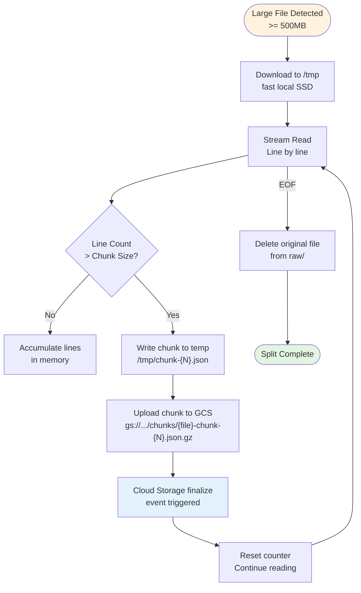

# Phase 2: File Splitting for Large Files



**Splitting Configuration:**

| Parameter | Value | Rationale |
|-----------|-------|-----------|
| **Threshold** | 500MB compressed | ~2.5GB uncompressed |
| **Chunk size** | 10,000 events | ~50MB per chunk |
| **Max chunks** | ~100 per file | 1.2GB → ~120 chunks |
| **Parallelism** | N chunks at once | Autoscaling handles |

**Chunk Filename Convention:**

```
{original-basename}-chunk-{chunk_number:03d}-of-{total_chunks:03d}-{event_count}.json.gz

Example: 2026-03-05-12-chunk-001-of-012-10000.json.gz
```

**File Splitter Job Specification:**

```hcl
resource "google_cloud_run_v2_job" "file_splitter" {
  name     = "github-archive-file-splitter"
  location = var.region

  template {
    template {
      containers {
        image = "us-central1-docker.pkg.dev/project/github-archive/file-splitter:latest"

        resources {
          limits = {
            cpu    = "2"
            memory = "4Gi"
          }
        }
      }

      timeout = "3600s"  # 1 hour
      task_count = 1     # Single task per file
    }
  }
}
```

**Chunk Processing Flow (Direct Events Only):**

```
┌─────────────────────────────────────────────────────────────────────────────────────────────────────────────┐
│                              CHUNK PROCESSING ORCHESTRATION (Direct Events)                                  │
├─────────────────────────────────────────────────────────────────────────────────────────────────────────────┤
│                                                                                                             │
│   File Splitter writes N chunks to GCS → Cloud Storage emits N direct events → N Cloud Run Tasks (parallel)  │
│                                                                                                             │
│   Flow:                                                                                                      │
│   ┌─────────────────────────────────────────────────────────────────────────────────────────────────────┐   │
│   │ 1. File Splitter uploads chunk to:                                                                  │   │
│   │    gs://.../chunks/2026-03-05-12-chunk-001-of-012-10000.json.gz                                    │   │
│   │                                                                                                      │   │
│   │ 2. Cloud Storage emits finalize event                                                               │   │
│   │                                                                                                      │   │
│   │ 3. Eventarc Trigger #2 (filtered for chunks/) routes to Cloud Run chunk processor                    │   │
│   │                                                                                                      │   │
│   │ 4. Chunk processor extracts metadata from filename:                                                 │   │
│   │    - Original file: 2026-03-05-12                                                                    │   │
│   │    - Chunk number: 001 of 012                                                                       │   │
│   │    - Event count: 10000                                                                             │   │
│   │                                                                                                      │   │
│   │ 5. Process chunk → Write to staging bucket                                                      │   │
│   └─────────────────────────────────────────────────────────────────────────────────────────────────────┘   │
│                                                                                                             │
│   Benefits:                                                                                                  │
│   • No Pub/Sub costs                                                                                        │
│   • Simpler architecture (no topic/subscription management)                                                │
│   • File is the source of truth                                                                             │
│   • Same latency as Pub/Sub (both use direct events)                                                        │
│                                                                                                             │
└─────────────────────────────────────────────────────────────────────────────────────────────────────────────┘
```
