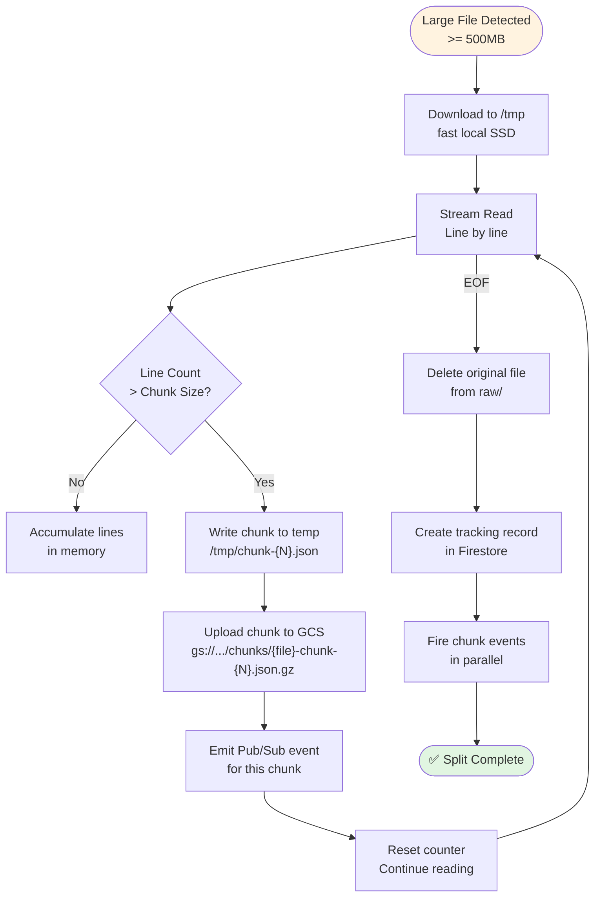

# Phase 2: File Splitting for Large Files



**Splitting Configuration:**

| Parameter | Value | Rationale |
|-----------|-------|-----------|
| **Threshold** | 500MB compressed | ~2.5GB uncompressed |
| **Chunk size** | 10,000 events | ~50MB per chunk |
| **Max chunks** | ~100 per file | 1.2GB → ~120 chunks |
| **Parallelism** | N chunks at once | Autoscaling handles |

**File Splitter Job Specification:**

```hcl
resource "google_cloud_run_v2_job" "file_splitter" {
  name     = "github-archive-file-splitter"
  location = var.region

  template {
    template {
      containers {
        image = "us-central1-docker.pkg.dev/project/github-archive/file-splitter:latest"

        resources {
          limits = {
            cpu    = "2"
            memory = "4Gi"
          }
        }
      }

      timeout = "3600s"  # 1 hour
      task_count = 1     # Single task per file
    }
  }
}
```

**Chunk Processing Flow:**

```
┌─────────────────────────────────────────────────────────────────────────────────────────────────────────────┐
│                              CHUNK PROCESSING ORCHESTRATION                                                 │
├─────────────────────────────────────────────────────────────────────────────────────────────────────────────┤
│                                                                                                             │
│   File Splitter emits N Pub/Sub events → N Cloud Run Tasks (parallel)                                       │
│                                                                                                             │
│   ┌─────────────────────────────────────────────────────────────────────────────────────────────────────┐   │
│   │ Firestore Document Tracking                                                                         │   │
│   │ Collection: file_chunks                                                                            │   │
│   │ Document ID: {original_file_name}                                                                  │   │
│   │ {                                                                                                   │   │
│   │   "original_file": "2026-03-05-12.json.gz",                                                         │   │
│   │   "status": "splitting",                                                                            │   │
│   │   "total_chunks": 15,                                                                               │   │
│   │   "chunks_processed": 0,                                                                           │   │
│   │   "chunks": [                                                                                      │   │
│   │     {"chunk_id": "chunk-001", "status": "pending", "output": "..."},                                │   │
│   │     {"chunk_id": "chunk-002", "status": "pending", "output": "..."},                                │   │
│   │     ...                                                                                             │   │
│   │   ],                                                                                                │   │
│   │   "created_at": "2026-03-05T12:00:00Z",                                                             │   │
│   │   "completed_at": null                                                                              │   │
│   │ }                                                                                                   │   │
│   └─────────────────────────────────────────────────────────────────────────────────────────────────────┘   │
│                                                             │                                             │
│                                    Each chunk processor updates status                                          │
│                                                             │                                             │
│                                                             ▼                                             │
│   ┌─────────────────────────────────────────────────────────────────────────────────────────────────────┐   │
│   │ When chunks_processed == total_chunks:                                                             │   │
│   │   → Update status to "completed"                                                                   │   │
│   │   → Trigger BigQuery load for all chunks                                                           │   │
│   │   → Mark original file as ready for cleanup                                                        │   │
│   └─────────────────────────────────────────────────────────────────────────────────────────────────────┘   │
│                                                                                                             │
└─────────────────────────────────────────────────────────────────────────────────────────────────────────────┘
```
