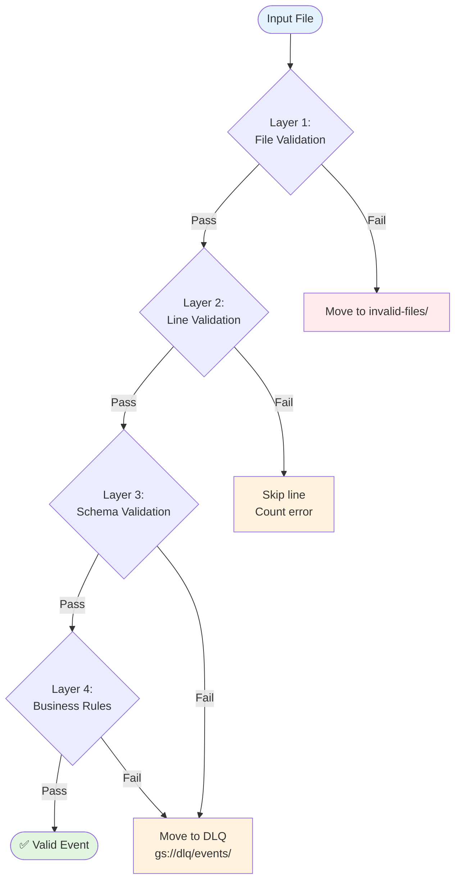

# Phase 2: Validation Layers



**Validation Layer Details:**

| Layer | What | Tools | Error Action |
|-------|------|-------|--------------|
| **Layer 1: File** | Extension, size, gzip | Python stdlib | Move to invalid-files/ |
| **Layer 2: Line** | Valid JSON, required fields | json.loads() | Skip line, count error |
| **Layer 3: Schema** | Field types, formats | Pydantic | Move to DLQ |
| **Layer 4: Business** | Event types, references | Custom validators | Move to DLQ |

**Validation Code Structure:**

```python
# validators/file_validator.py - Layer 1
async def validate_file(bucket: str, file_path: str) -> ValidationResult:
    """Validate file before processing"""
    # 1. Check extension
    if not file_path.endswith('.json.gz'):
        return ValidationResult.invalid("Invalid file extension")

    # 2. Check file size
    storage_client = storage.Client()
    bucket = storage_client.bucket(bucket)
    blob = bucket.blob(file_path)
    size = blob.size

    if size == 0 or size > 10 * 1024 * 1024 * 1024:  # 10GB max
        return ValidationResult.invalid(f"Invalid file size: {size}")

    # 3. Validate gzip
    try:
        with gzip.open(blob.open('rb')) as f:
            f.read(1)  # Try to read first byte
    except Exception as e:
        return ValidationResult.invalid(f"Invalid gzip: {e}")

    return ValidationResult.valid()

# validators/line_validator.py - Layer 2
async def validate_line(line: str, line_num: int) -> ValidationResult:
    """Validate individual JSON lines"""
    try:
        data = json.loads(line)
    except json.JSONDecodeError as e:
        return ValidationResult.invalid(f"Line {line_num}: Invalid JSON: {e}")

    # Check required fields
    required = ['id', 'type', 'created_at', 'actor', 'repo']
    for field in required:
        if field not in data:
            return ValidationResult.invalid(f"Line {line_num}: Missing {field}")

    return ValidationResult.valid(data)

# validators/schema_validator.py - Layer 3
from schemas.github_event_schema import GitHubEventBase

async def validate_schema(event: dict) -> ValidationResult:
    """Validate against Pydantic schema"""
    try:
        validated = GitHubEventBase(**event)
        return ValidationResult.valid(validated)
    except ValidationError as e:
        return ValidationResult.invalid(f"Schema error: {e}")

# validators/business_validator.py - Layer 4
async def validate_business_rules(event: GitHubEventBase) -> ValidationResult:
    """Validate business rules"""
    # Event type validation
    valid_types = get_valid_event_types()
    if event.type not in valid_types:
        return ValidationResult.invalid(f"Invalid event type: {event.type}")

    # Timestamp validation
    if event.created_at > datetime.utcnow():
        return ValidationResult.invalid("Future timestamp")

    return ValidationResult.valid()
```

**Error Handling Flow:**

```
┌─────────────────────────────────────────────────────────────────────────────────────────────────────────────┐
│                              ERROR HANDLING DECISION TREE                                                   │
├─────────────────────────────────────────────────────────────────────────────────────────────────────────────┤
│                                                                                                             │
│   Error Detected                                                                                            │
│        │                                                                                                     │
│        ▼                                                                                                     │
│   ┌─────────────────────────────────────────────────────────────────────────────────────────────────────┐   │
│   │ Is the ENTIRE file corrupt?                                                                         │   │
│   │ • Bad gzip                                                                                          │   │
│   │ • Wrong format                                                                                      │   │
│   │ • Empty file                                                                                        │   │
│   └─────────────────────────────────────────────────────────────────────────────────────────────────────┘   │
│        │ Yes                                    │ No                                                     │
│        ▼                                       ▼                                                        │
│   Move entire file to:                      Continue processing                                       │
│   gs://.../invalid-files/{file}.json.gz     ┌────────────────────────────────────────────────────────┐   │
│                                            │ Can we skip this line/event?                         │   │
│                                            └────────────────────────────────────────────────────────┘   │
│                                                        │ Yes                │ No                      │
│                                                        ▼                   ▼                         │
│                                                 Skip line              Move to DLQ:                │
│                                                 + count error           gs://.../dlq/events/       │
│                                                 + continue              • Log error                 │
│                                                                         • Continue                  │
│                                                                                                            │
│   ┌─────────────────────────────────────────────────────────────────────────────────────────────────────┐   │
│   │ DLQ Processing (separate Cloud Run Job)                                                           │   │
│   │ • Runs every 10 minutes                                                                             │   │
│   │ • Analyzes failed events                                                                           │   │
│   │ • Retry transient errors (3x)                                                                      │   │
│   │ • Move permanent failures to gs://.../dlq/permanent/                                              │   │
│   └─────────────────────────────────────────────────────────────────────────────────────────────────────┘   │
│                                                                                                            │
└─────────────────────────────────────────────────────────────────────────────────────────────────────────────┘
```
