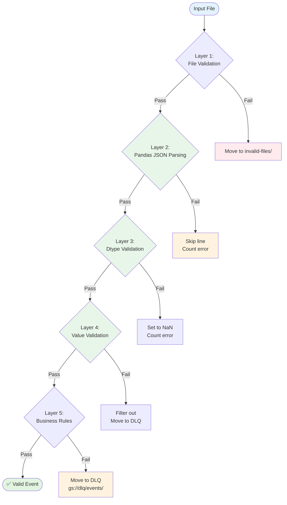

# Phase 2: Validation Layers



**Validation Layer Details:**

| Layer | What | Tools | Error Action |
|-------|------|-------|--------------|
| **Layer 1: File** | Extension, size, gzip | Python stdlib | Move to invalid-files/ |
| **Layer 2: Parsing** | Valid JSON, chunked reading | pd.read_json(chunksize=N) | Skip line, count error |
| **Layer 3: Dtype** | Field types, coercion | df.astype(dtype) | Set to NaN, count error |
| **Layer 4: Value** | Required fields, event types | df.isin(), df.isnull() | Filter out, move to DLQ |
| **Layer 5: Business** | Timestamps, references | Custom validators | Move to DLQ |

**Chunked Processing with Pandas:**

```python
# processors/chunked_processor.py
import pandas as pd
from typing import Iterator, Dict, Any

class ChunkedEventProcessor:
    """Process GitHub events in chunks using pandas"""

    def __init__(self, chunksize: int = 100_000):
        self.chunksize = chunksize

    def process_file(self, file_path: str) -> Dict[str, int]:
        """Process file in chunks with validation"""
        stats = {'total': 0, 'valid': 0, 'invalid': 0, 'chunks': 0}

        # Create chunk iterator
        chunk_iterator = pd.read_json(
            file_path,
            lines=True,
            chunksize=self.chunksize
        )

        for chunk in chunk_iterator:
            stats['chunks'] += 1

            # Layer 3: Dtype validation (vectorized)
            chunk = self.validate_dtypes(chunk)

            # Layer 4: Value validation (vectorized)
            valid, invalid = self.validate_values(chunk)
            stats['total'] += len(chunk)
            stats['valid'] += len(valid)
            stats['invalid'] += len(invalid)

            # Layer 5: Business rules
            valid = self.validate_business_rules(valid)

            # Write output immediately
            self.write_chunk(valid)

            # Chunk is discarded from memory

        return stats

    def validate_dtypes(self, df: pd.DataFrame) -> pd.DataFrame:
        """Coerce dtypes (Layer 3)"""
        dtype_map = {
            'id': 'string',
            'type': 'string',
            'created_at': 'string',
            'public': 'boolean'
        }
        for col, dtype in dtype_map.items():
            if col in df.columns:
                df[col] = df[col].astype(dtype, errors='coerce')
        return df

    def validate_values(self, df: pd.DataFrame) -> tuple:
        """Validate values (Layer 4)"""
        # Check required fields
        required = ['id', 'type', 'created_at', 'actor', 'repo']
        missing_mask = df[required].isnull().any(axis=1)

        # Validate event type (vectorized)
        valid_types = {'PushEvent', 'PullRequestEvent', 'IssuesEvent', 'WatchEvent', 'ForkEvent'}
        invalid_type_mask = ~df['type'].isin(valid_types)

        # Combine invalid conditions
        invalid_mask = missing_mask | invalid_type_mask

        valid = df[~invalid_mask].copy()
        invalid = df[invalid_mask].copy()

        return valid, invalid

    def validate_business_rules(self, df: pd.DataFrame) -> pd.DataFrame:
        """Business rules (Layer 5)"""
        # Example: no future timestamps
        df['created_at_dt'] = pd.to_datetime(df['created_at'], errors='coerce')
        valid = df[df['created_at_dt'] <= pd.Timestamp.now(tz='UTC')].copy()
        return valid
```

**Memory Usage Comparison:**

| Approach | File Size | Peak Memory | Time |
|----------|-----------|-------------|------|
| Load all at once | 600MB | ~4GB | 15 seconds |
| Chunks of 100K | 600MB | ~500MB | 20 seconds |
| Chunks of 10K | 600MB | ~50MB | 35 seconds |

**Recommended:** `chunksize=100_000` for best balance of speed and memory.
