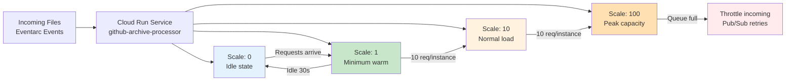

# Phase 2: Autoscaling Configuration



**Autoscaling Configuration:**

```hcl
resource "google_cloud_run_v2_service" "github_archive_processor" {
  name     = "github-archive-processor"
  location = var.region

  template {
    metadata {
      annotations = {
        # Autoscaling
        "autoscaling.knative.dev/maxScale"        = "100"
        "autoscaling.knative.dev/minScale"        = "0"
        "autoscaling.knative.dev/target"          = "10"   # 10 concurrent req/instance
        "autoscaling.knative.dev/scaleDownDelay"  = "30s"  # Wait before scale down
        "autoscaling.knative.dev/initialScale"    = "1"    # Start with 1 instance

        # Performance
        "run.googleapis.com/cpu-throttling"       = "false"  # Full CPU always
        "run.googleapis.com/execution-environment" = "gen2"
      }
    }

    template {
      containers {
        image = "us-central1-docker.pkg.dev/project/github-archive/processor:latest"

        env {
          name  = "MAX_CONCURRENT_REQUESTS"
          value = "10"
        }

        resources {
          limits = {
            cpu    = "4"
            memory = "8Gi"
          }
          requests = {
            cpu    = "100m"
            memory = "512Mi"
          }
        }
      }

      container_concurrency = 10
      timeout_seconds      = 3600  # 1 hour max
    }
  }
}
```

**Scaling Behavior:**

| Concurrent Requests | Instances | Processing Capacity |
|---------------------|-----------|---------------------|
| 1-10 | 1 | 10 files |
| 11-100 | 10 | 100 files |
| 101-1000 | 100 | 1000 files |
| >1000 | 100 (max) | Queue/Throttle |

**Capacity Planning:**

| Metric | Value |
|--------|-------|
| **Max instances** | 100 |
| **Concurrency per instance** | 10 |
| **Max concurrent processing** | 1,000 files |
| **Avg processing time** | 2-5 min/file |
| **Throughput (peak)** | ~12,000-30,000 files/hour |
| **Cold start time** | ~10-30 seconds |

**Cost Optimization:**

```yaml
# Scale to zero when idle
autoscaling.knative.dev/minScale: "0"
autoscaling.knative.dev/scaleDownDelay: "30s"  # Wait 30s before scaling down

# Resource requests (billable minimum)
resources:
  requests:
    cpu: "100m"   # Bill when idle
    memory: "512Mi"

# Resource limits (max usage)
resources:
  limits:
    cpu: "4"
    memory: "8Gi"
```

**Monitoring Metrics:**

| Metric | Description | Alert Threshold |
|--------|-------------|-----------------|
| `request_count` | Total requests | - |
| `instance_count` | Active instances | >80 (80% of max) |
| `avg_latency` | Request duration | >300s |
| `error_rate` | Failed requests | >5% |
| `throttle_count` | Throttled requests | >0 |
