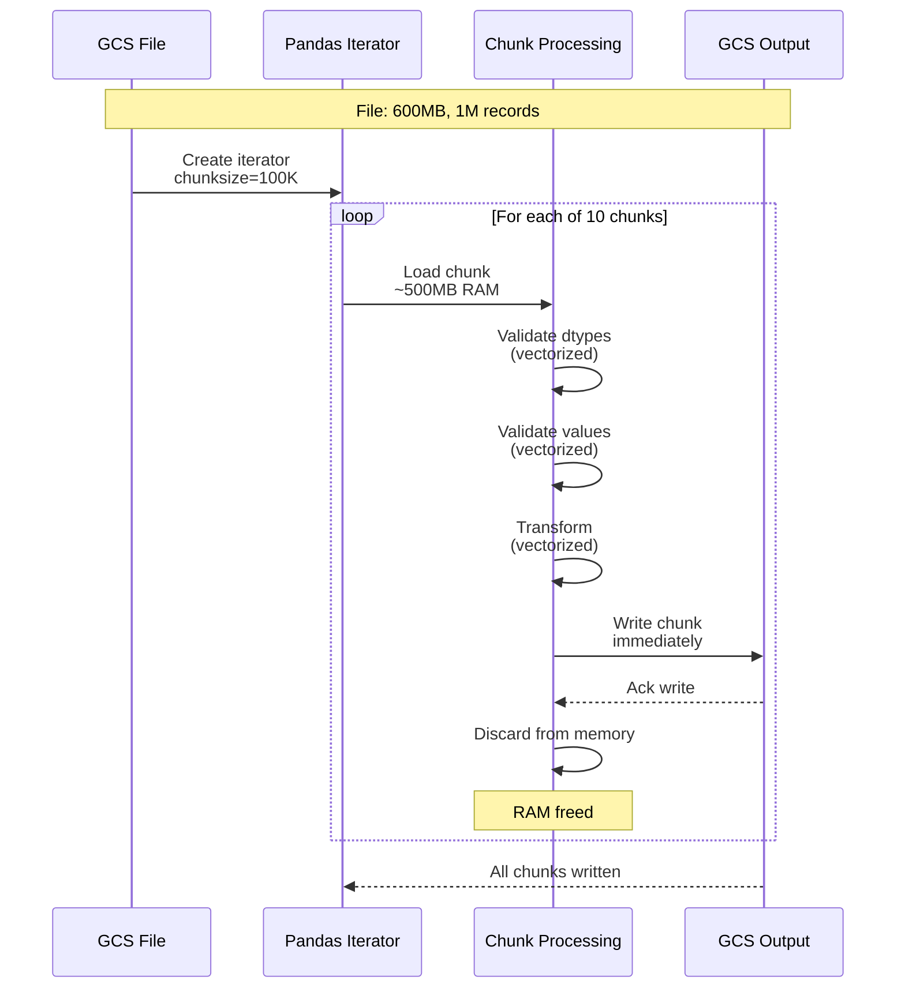

# Phase 2: Chunked Processing with Pandas

## Overview

Pandas chunked processing allows handling large files (500MB - 5GB) without loading everything into memory at once. Each chunk is processed, validated, transformed, and written to output before the next chunk is loaded.

```mermaid
graph TB
    subgraph Input["INPUT: Large File"]
        File["gs://landing/raw/2025-03-05-14.json.gz<br/>600MB, ~1M records"]
    end

    subgraph Pandas["PANDAS CHUNKED PROCESSING"]
        Iterator["pd.read_json(chunksize=100_000)<br/>Creates iterator"]

        subgraph Chunk1["CHUNK 1: Records 0-99,999"]
            C1_Load["Load into memory<br/>~500MB"]
            C1_Valid["Validate (vectorized)<br/>Dtype + Value checks"]
            C1_Trans["Transform (vectorized)<br/>Extract nested fields"]
            C1_Write["Write to output<br/>gs://staging/..."]
            C1_Discard["Discard from memory<br/>Free RAM"]
        end

        subgraph Chunk2["CHUNK 2: Records 100,000-199,999"]
            C2_Load["Load into memory<br/>~500MB"]
            C2_Valid["Validate (vectorized)"]
            C2_Trans["Transform (vectorized)"]
            C2_Write["Write to output"]
            C2_Discard["Discard from memory"]
        end

        subgraph ChunkN["CHUNK N: Records 900,000-999,999"]
            CN_Load["Load into memory<br/>~500MB"]
            CN_Valid["Validate (vectorized)"]
            CN_Trans["Transform (vectorized)"]
            CN_Write["Write to output"]
            CN_Discard["Discard from memory"]
        end
    end

    subgraph Output["OUTPUT: Aggregated"]
        OutFile["gs://staging/processed/2025-03-05-14.ndjson.gz<br/>All chunks combined"]
    end

    File --> Iterator
    Iterator --> Chunk1
    Chunk1 --> C1_Load --> C1_Valid --> C1_Trans --> C1_Write --> C1_Discard
    C1_Discard --> Chunk2
    Chunk2 --> C2_Load --> C2_Valid --> C2_Trans --> C2_Write --> C2_Discard
    C2_Discard --> ChunkN
    ChunkN --> CN_Load --> CN_Valid --> CN_Trans --> CN_Write --> CN_Discard --> OutFile

    style C1_Discard fill:#f5f5f5
    style C2_Discard fill:#f5f5f5
    style CN_Discard fill:#f5f5f5
    style C1_Valid fill:#e8f5e9
    style C2_Valid fill:#e8f5e9
    style CN_Valid fill:#e8f5e9
```



## Key Benefits

| Benefit | Description |
|---------|-------------|
| **Memory Control** | Peak memory = chunk size, not file size |
| **Scalability** | Process 10GB files on 4GB Cloud Run instance |
| **Early Output** | Start writing results before finishing input |
| **Fault Tolerance** | If chunk 5 fails, chunks 1-4 are already done |
| **Vectorized Speed** | 2-10x faster than row-by-row processing |

## Configuration

```python
# config.py
class ChunkedProcessingConfig:
    # Chunk size: number of records per chunk
    CHUNKSIZE = 100_000  # ~500MB memory per chunk

    # Memory limits
    MAX_MEMORY_GB = 4  # Cloud Run memory limit
    MEMORY_HEADROOM = 0.5  # Keep 50% free

    # Validation settings
    VALIDATION_MODE = "vectorized"  # "vectorized" or "sample"
    SAMPLE_RATE = 0.1  # For sample validation

    # Output settings
    OUTPUT_FORMAT = "ndjson"  # Newline-delimited JSON
    COMPRESSION = "gzip"
```

## Dynamic Chunk Size Calculation

```python
import psutil

def calculate_optimal_chunk_size():
    """Calculate optimal chunk size based on available memory"""
    available_gb = psutil.virtual_memory().available / (1024**3)
    usable_gb = available_gb * 0.5  # Keep 50% headroom

    # Rough estimate: 1M records ≈ 1GB in pandas
    records_per_gb = 1_000_000
    optimal_records = int(usable_gb * records_per_gb)

    # Round to sensible values
    if optimal_records < 10_000:
        return 10_000
    elif optimal_records < 100_000:
        return 100_000
    elif optimal_records < 1_000_000:
        return 500_000
    else:
        return 1_000_000
```

## Processing Flow



## Memory Timeline

```
Time    Memory Usage    Action
───────────────────────────────────────────────────────────
T+0s    100 MB          Create iterator
T+1s    600 MB          Load chunk 1 (100K records)
T+3s    600 MB          Validate + transform chunk 1
T+5s    600 MB          Write chunk 1
T+6s    100 MB          Discard chunk 1
T+7s    600 MB          Load chunk 2
...     ...             ...
T+60s   100 MB          All chunks complete

Peak: 600 MB (not 4GB for full file!)
```

## Error Handling per Chunk

| Error Type | Handling | Continuation |
|------------|----------|--------------|
| JSON parse errors | Skip line, count error | Continue to next record |
| Dtype coercion | Set to NaN, count error | Continue processing |
| Value validation | Filter out invalid rows | Continue with valid rows |
| Chunk write failure | Retry (3x), then DLQ | Move to next chunk |
| Transform failure | Log error, skip row | Continue to next row |

## Integration with File Splitter

For files >= 500MB, the file splitter creates chunks that are sized appropriately for pandas chunked processing:

```
Large File (600MB)
    ↓
File Splitter creates 12 chunks of ~50MB each
    ↓
Each chunk processed independently via Eventarc
    ↓
Pandas processes each chunk in one load (fits in memory)
```
