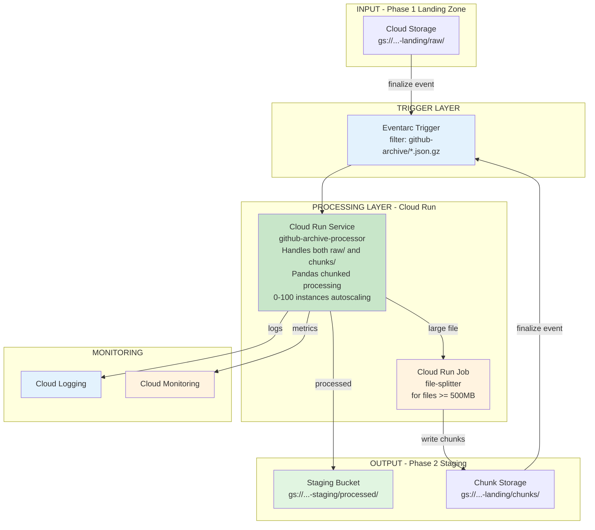

# Phase 2: Component View

**Component Summary:**

| Component | Type | Purpose |
|-----------|------|---------|
| Eventarc Trigger | Trigger | Detects new files in raw/ and chunks/ |
| Cloud Run Service (Processor) | Compute | Single service handles both raw files and chunks via path filtering (autoscaling) |
| Cloud Run Job | Compute | File splitter for large files |
| Staging Bucket | Storage | Processed files in NDJSON format |
| Chunks Bucket | Storage | Split file chunks |
| Cloud Logging | Monitoring | Execution logs & error tracking |
| Cloud Monitoring | Monitoring | Metrics and alerts |

**Architecture Note:** A single Cloud Run service handles both raw/ and chunks/ paths. Path filtering is done in the Flask handler (`main.py` lines 136-149) to route files to the appropriate processing logic.
