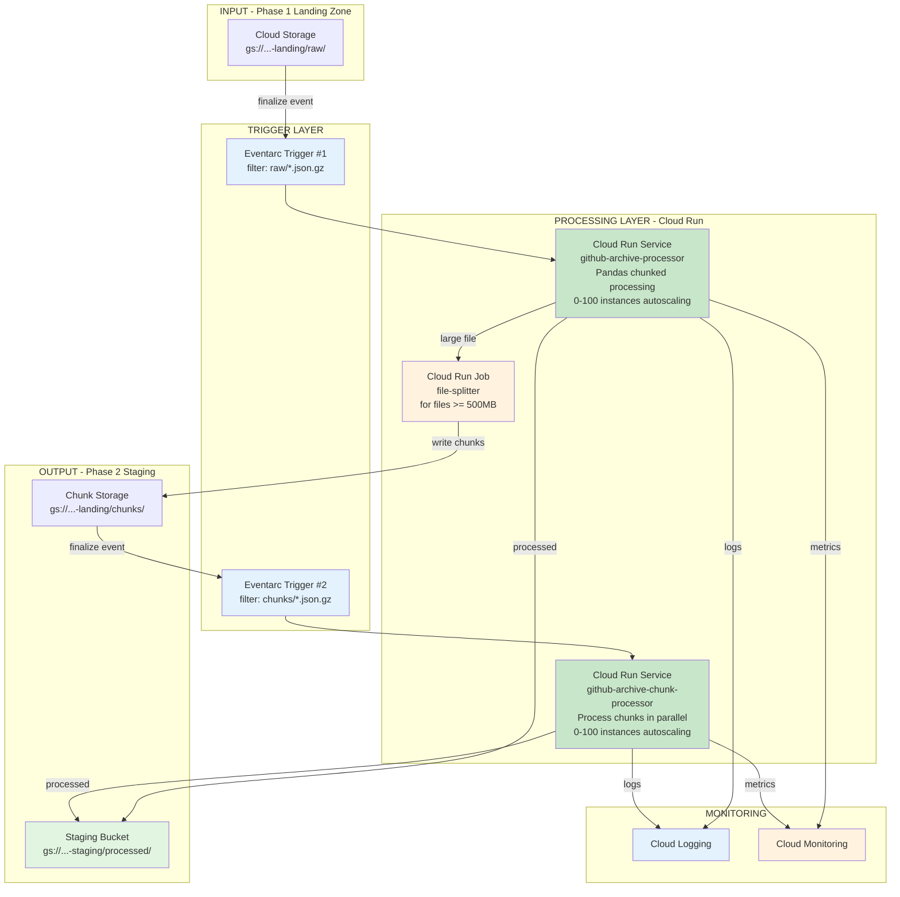

# Phase 2: Component View

**Component Summary:**

| Component | Type | Purpose |
|-----------|------|---------|
| Eventarc Trigger #1 | Trigger | Detects new files in raw/ |
| Eventarc Trigger #2 | Trigger | Detects new chunk files in chunks/ |
| Cloud Run Service (Processor) | Compute | Main processor with Pandas chunked processing (autoscaling) |
| Cloud Run Service (Chunk Processor) | Compute | Chunk processor for parallel processing |
| Cloud Run Job | Compute | File splitter for large files |
| Staging Bucket | Storage | Processed files in NDJSON format |
| Chunks Bucket | Storage | Split file chunks |
| Cloud Logging | Monitoring | Execution logs & error tracking |
| Cloud Monitoring | Monitoring | Metrics and alerts |
