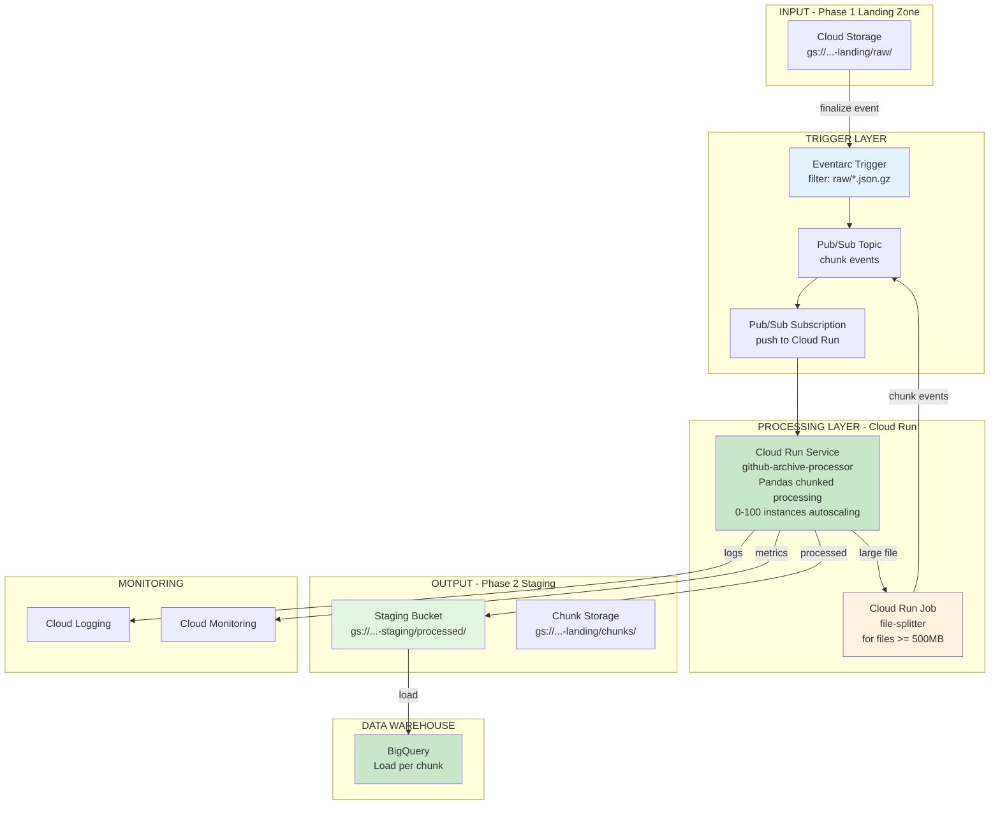

# Phase 2: Component View

**Component Summary:**

| Component | Type | Purpose |
|-----------|------|---------|
| Eventarc Trigger | Trigger | Detects new files in raw/ |
| Pub/Sub Topic | Messaging | Chunk events for large files |
| Pub/Sub Subscription | Push | Delivers messages to Cloud Run |
| Cloud Run Service | Compute | Main processor with Pandas chunked processing (autoscaling) |
| Cloud Run Job | Compute | File splitter for large files |
| Staging Bucket | Storage | Processed files for BigQuery |
| Chunks Bucket | Storage | Split file chunks |
| BigQuery | Data Warehouse | Loads each chunk as finalized |
| Cloud Logging | Monitoring | Execution logs & error tracking |
| Cloud Monitoring | Monitoring | Metrics and alerts |
