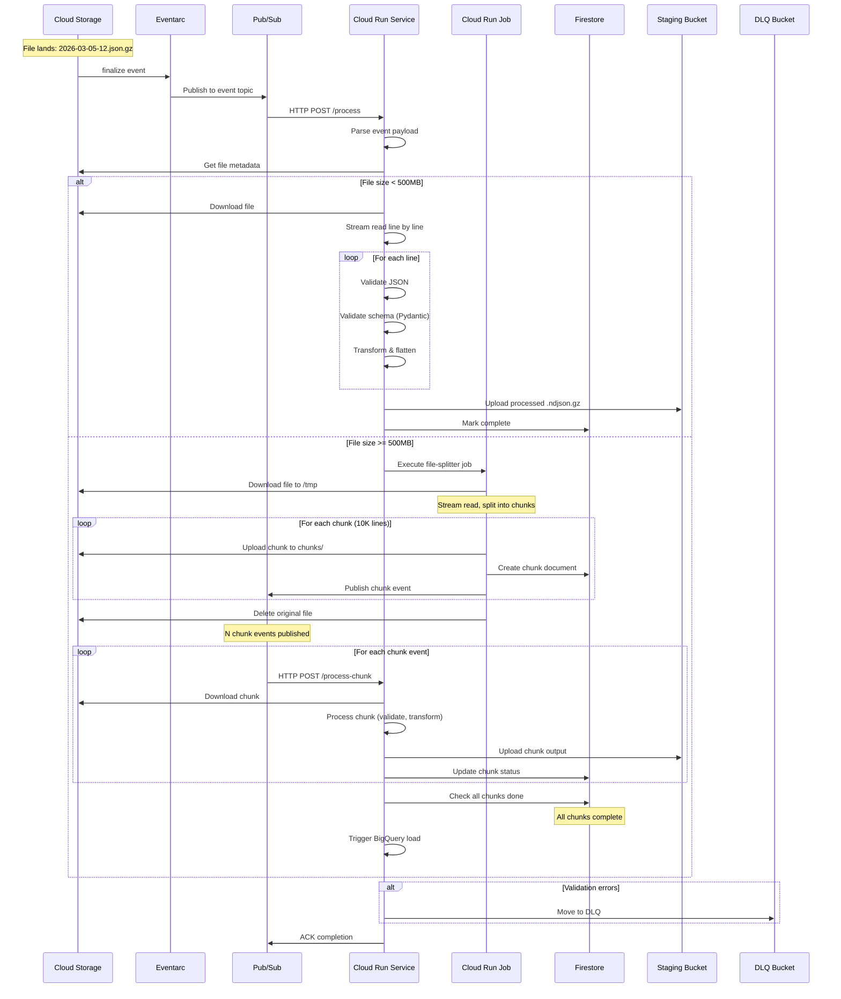

# Phase 2: Detailed Sequence Diagram

**Sequence Notes:**
- Small files processed directly in single request
- Large files split first, then processed in parallel
- Each chunk processed independently (autoscaling)
- Firestore tracks progress for large files
