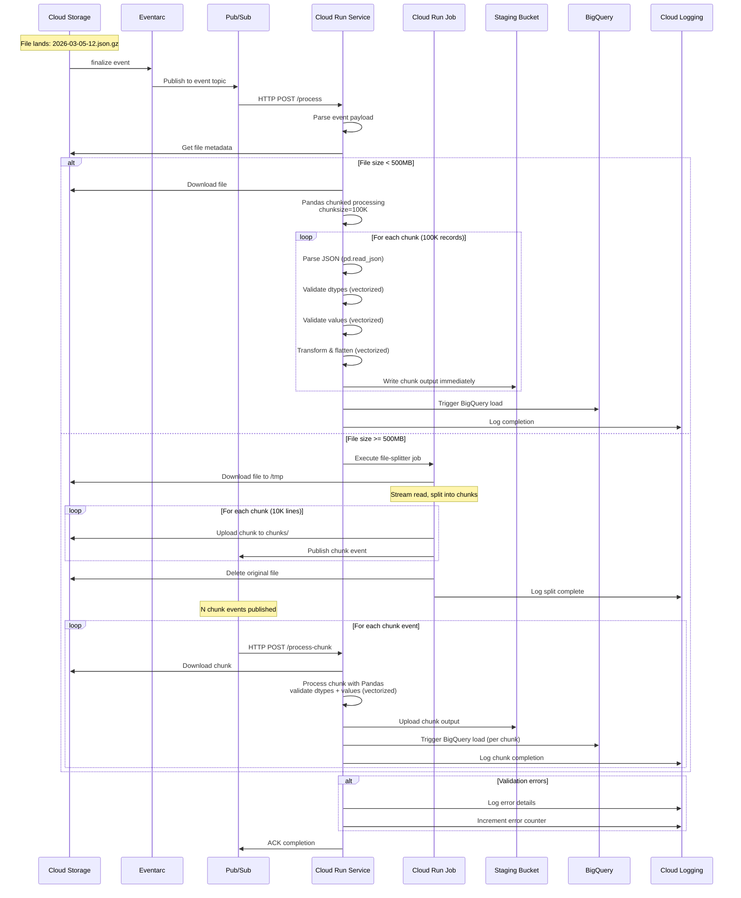

# Phase 2: Detailed Sequence Diagram

**Sequence Notes:**
- Small files processed directly in single request
- Large files split first, then processed in parallel via Pub/Sub
- Each chunk triggers BigQuery load immediately upon completion (no state tracking)
- All errors logged to Cloud Logging with monitoring alerts
