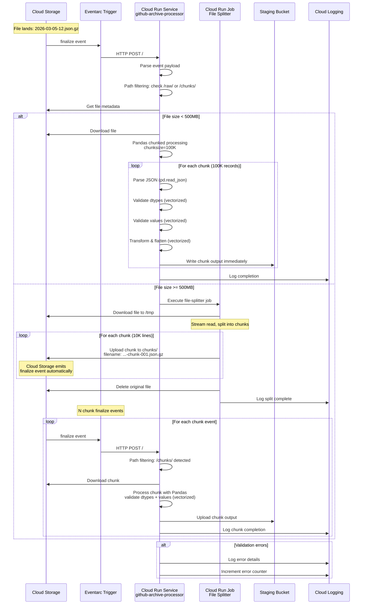

# Phase 2: Detailed Sequence Diagram

**Sequence Notes:**
- Single Cloud Run service handles both raw files and chunks via path filtering
- Small files processed directly in single request
- Large files split first, then each chunk triggers processing via direct events
- Phase 2 ends when validated data is written to staging bucket in NDJSON format
- All errors logged to Cloud Logging with monitoring alerts
- **No Pub/Sub costs** - all triggers use direct events from Cloud Storage
