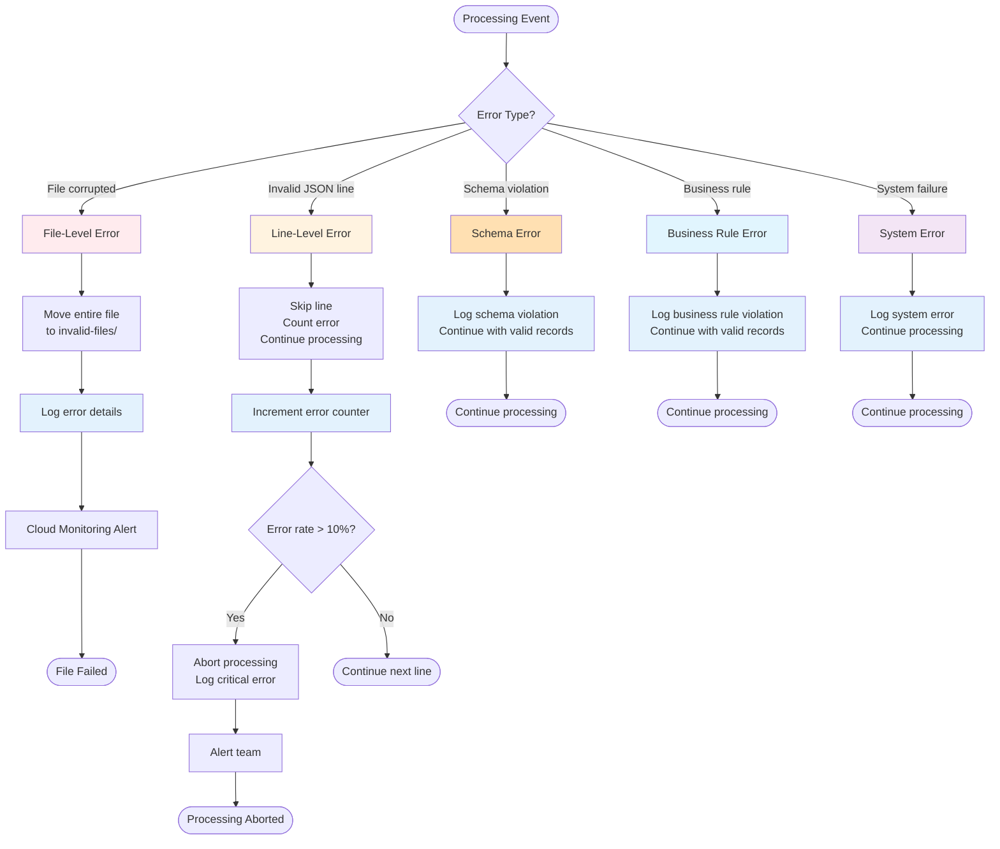
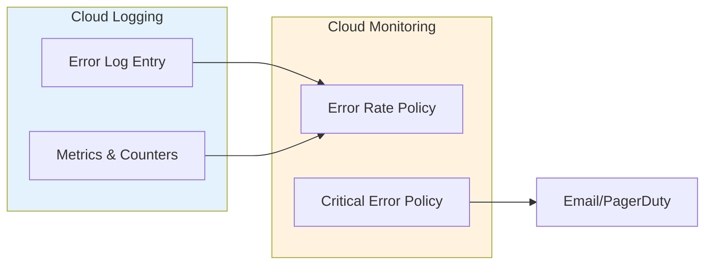

# Phase 2: Error Handling Flow



**Error Categories:**

| Category | Action | Logging | Example |
|----------|--------|---------|---------|
| **File corrupted** | Move to `invalid-files/` | ERROR level | Bad gzip, wrong format |
| **Line malformed** | Skip line, continue | WARN level + counter | Invalid JSON |
| **Schema violation** | Skip record, continue | WARN level + counter | Missing required field |
| **Business rule** | Skip record, continue | WARN level + counter | Invalid event type |
| **System error** | Log, continue | ERROR level | Network timeout (non-fatal) |
| **High error rate** | Abort processing | CRITICAL + alert | >10% errors |

**Logging Strategy:**



**Log Entry Structure:**

```json
{
  "severity": "ERROR",
  "logName": "projects/my-project/logs/github-archive-processor",
  "resource": {
    "type": "cloud_run_revision",
    "labels": {
      "service_name": "github-archive-processor",
      "revision_name": "github-archive-processor-0001"
    }
  },
  "protoPayload": {
    "@type": "type.googleapis.com/google.logging.audit"
  },
  "jsonPayload": {
    "file": "2026-03-05-12.json.gz",
    "error_type": "schema_violation",
    "message": "Missing required field: actor.id",
    "line_number": 12345,
    "record_id": "9876543210",
    "error_count": 1
  }
}
```
