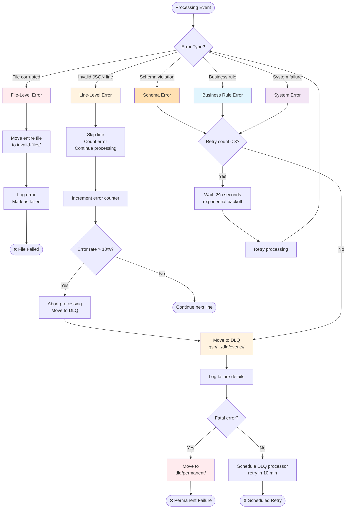
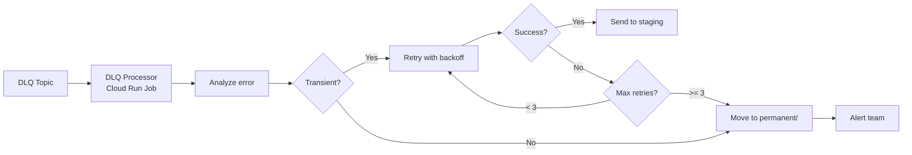

# Phase 2: Error Handling Flow

**Error Categories:**

| Category | Retry? | Destination | Example |
|----------|--------|-------------|---------|
| **File corrupted** | No | `invalid-files/` | Bad gzip, wrong format |
| **Line malformed** | No | Skip, log | Invalid JSON |
| **Schema error** | Yes (3x) | `dlq/events/` | Missing required field |
| **Business rule** | Yes (3x) | `dlq/events/` | Invalid event type |
| **Transient** | Yes (3x) | `dlq/events/` | Network timeout |
| **Permanent** | No | `dlq/permanent/` | Invalid data structure |

**DLQ Processor:**

