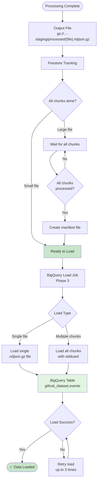

# Phase 2: BigQuery Load Preparation



**Output Format for BigQuery:**

```json
// Input: gs://landing/raw/2026-03-05-12.json.gz (nested JSON)
{
  "id": "1234567890",
  "type": "PushEvent",
  "created_at": "2026-03-05T12:34:56Z",
  "actor": {
    "id": 12345,
    "login": "octocat",
    "avatar_url": "https://...",
    "gravatar_id": "",
    "url": "https://api.github.com/users/octocat",
    "type": "User"
  },
  "repo": {
    "id": 67890,
    "name": "octocat/Hello-World",
    "url": "https://api.github.com/repos/octocat/Hello-World"
  },
  "payload": {
    "ref": "refs/heads/main",
    "push_id": 987654321,
    "size": 123,
    "distinct_size": 45,
    "head": "abc123...",
    "before": "def456..."
  },
  "public": true,
  "created_at": "2026-03-05T12:34:56Z"
}

// Output: gs://staging/processed/2026-03-05-12.ndjson.gz (flattened NDJSON)
{"event_id":"1234567890","event_type":"PushEvent","created_at":"2026-03-05T12:34:56Z","actor_id":12345,"actor_login":"octocat","actor_avatar_url":"https://...","actor_gravatar_id":"","actor_url":"https://api.github.com/users/octocat","actor_type":"User","repo_id":67890,"repo_name":"octocat/Hello-World","repo_url":"https://api.github.com/repos/octocat/Hello-World","public":true,"payload_ref":"refs/heads/main","payload_push_id":987654321,"payload_size":123,"payload_distinct_size":45,"payload_head":"abc123...","payload_before":"def456..."}
```

**BigQuery Load Command (Phase 3):**

```bash
# Single file
bq load --source_format=NEWLINE_DELIMITED_JSON \
  --field_delimiter="\n" \
  project:github_dataset.events \
  gs://...-staging/processed/2026-03-05-12.ndjson.gz

# Multiple chunks (wildcard)
bq load --source_format=NEWLINE_DELIMITED_JSON \
  --field_delimiter="\n" \
  project:github_dataset.events \
  gs://...-landing/chunks/2026-03-05-12-*.ndjson.gz
```

**Manifest File (for large files):**

```json
{
  "loadFiles": [
    {"uri": "gs://...-staging/processed/2026-03-05-12-chunk-001.ndjson.gz"},
    {"uri": "gs://...-staging/processed/2026-03-05-12-chunk-002.ndjson.gz"},
    {"uri": "gs://...-staging/processed/2026-03-05-12-chunk-003.ndjson.gz"}
  ]
}
```
