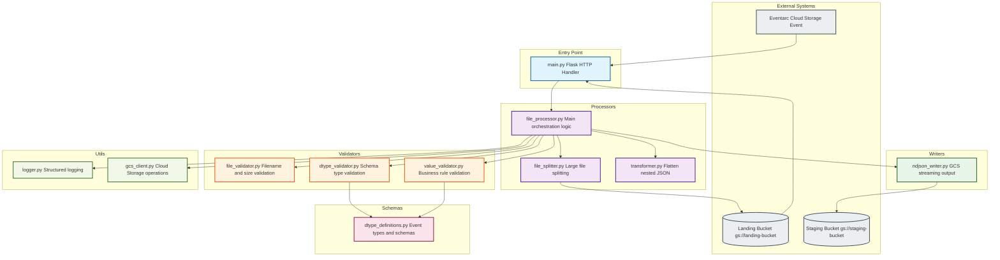

# Phase 2 Processing - Code Architecture & Module Structure

## Overview

This diagram shows the Python module structure for Phase 2 processing, including the flow of data through validators, transformers, and writers.

## Module Architecture Diagram



## Module Index

| Module | File | Purpose |
|--------|------|---------|
| **Entry** | [main.py](../../src/github_archive/phase2_process_files/main.py) | Flask HTTP server, Eventarc handler, health/readiness endpoints |
| **Core** | [file_processor.py](../../src/github_archive/phase2_process_files/processors/file_processor.py) | Main orchestration: validate to read chunk to transform to write |
| **Transform** | [transformer.py](../../src/github_archive/phase2_process_files/processors/transformer.py) | Flattens nested GitHub JSON to flat schema |
| **File Validator** | [file_validator.py](../../src/github_archive/phase2_process_files/validators/file_validator.py) | Filename pattern, file size checks, split threshold |
| **Dtype Validator** | [dtype_validator.py](../../src/github_archive/phase2_process_files/validators/dtype_validator.py) | Validates DataFrame column types |
| **Value Validator** | [value_validator.py](../../src/github_archive/phase2_process_files/validators/value_validator.py) | Business rule validation (event types, required fields) |
| **Writer** | [ndjson_writer.py](../../src/github_archive/phase2_process_files/writers/ndjson_writer.py) | Streams NDJSON output to GCS with gzip |
| **Schema** | [dtype_definitions.py](../../src/github_archive/phase2_process_files/schemas/dtype_definitions.py) | Event types, field mappings, validation rules |
| **Logger** | [logger.py](../../src/github_archive/phase2_process_files/utils/logger.py) | Structured JSON logging with metrics |
| **GCS Client** | [gcs_client.py](../../src/github_archive/phase2_process_files/utils/gcs_client.py) | Cloud Storage download/upload utilities |

## Directory Structure

```
src/github_archive/phase2_process_files/
├── __init__.py
├── main.py                          # Flask entry point
├── schemas/
│   ├── __init__.py
│   └── dtype_definitions.py         # Type definitions and validation rules
├── validators/
│   ├── __init__.py
│   ├── file_validator.py            # File-level validation
│   ├── dtype_validator.py           # Data type validation
│   └── value_validator.py           # Value validation
├── processors/
│   ├── __init__.py
│   ├── file_processor.py            # Main processing orchestration
│   ├── file_splitter.py             # Large file splitting
│   └── transformer.py               # JSON flattening
├── writers/
│   ├── __init__.py
│   └── ndjson_writer.py             # NDJSON output to GCS
└── utils/
    ├── __init__.py
    ├── logger.py                    # Structured logging
    └── gcs_client.py                # GCS operations
```

## Processing Flow Summary

1. **Eventarc** triggers `main.py` when new file lands in landing bucket
2. **main.py** calls `file_processor.process_file()`
3. **file_validator** checks filename pattern and size
4. If file to threshold to **file_splitter** splits into chunks
5. **dtype_validator** validates DataFrame column types
6. **value_validator** checks business rules (event types, required fields)
7. **transformer** flattens nested JSON to output schema
8. **ndjson_writer** streams output to staging bucket in GCS
