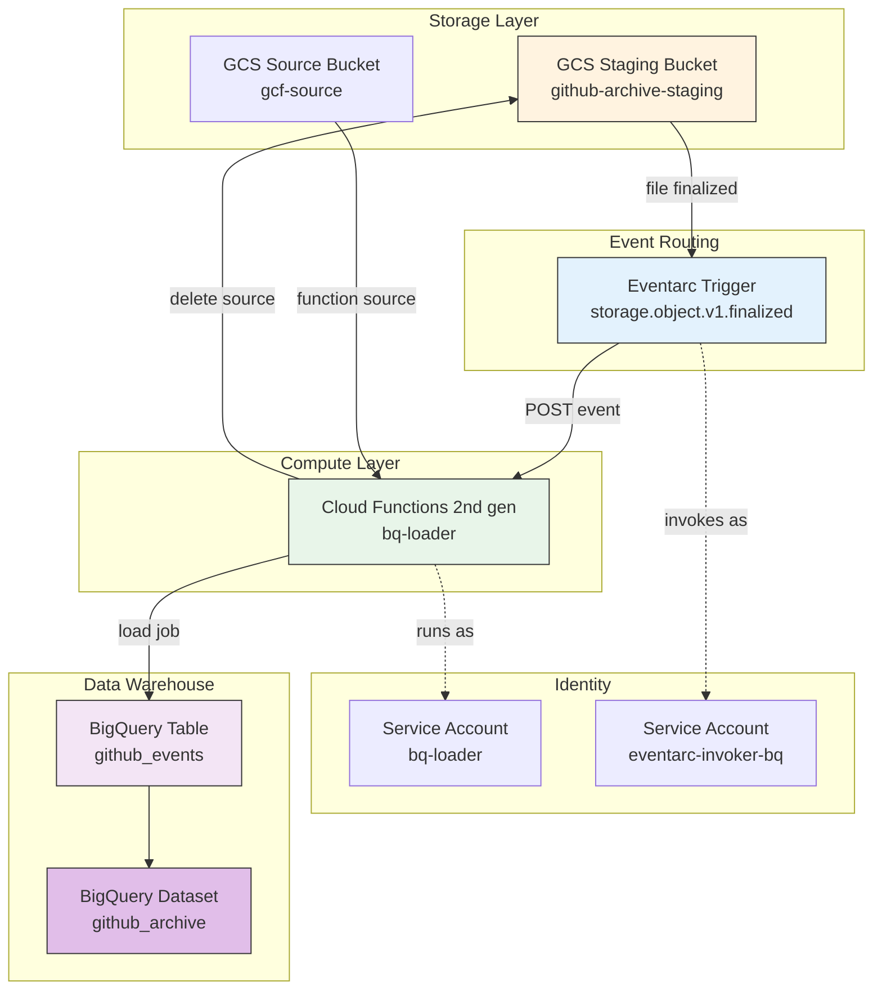

# Phase 3: BigQuery Loading Design

## Overview

Phase 3 implements the data loading layer that loads processed NDJSON files from the staging bucket into BigQuery. It handles automatic deletion of source files after successful load.

## Architecture



## Components
### 1. Cloud Functions 2nd Gen
| Property | Value | Notes |
|----------|-------|-------|
| **Name** | `{env}-bq-loader` | Environment-prefixed |
| **Runtime** | Python 3.11 | Via Cloud Build |
 **Entry Point** | `load_to_bigquery` | |
| **Memory** | 1Gi (configurable) | Default for CF 2.5GB |
| **CPU** | 1 | Default |
| **Timeout** | 60s (default) | Max 3600s |
| **Max Instances** | 5 | Default |
| **Trigger** | Eventarc (GCS finalized) | Built-in trigger |
| **Injection** | `ALLOW_INTERNAL_ONLY` | No external access |

| **Region** | `us-central1` | Same as all resources |

### 2. BigQuery Dataset
| Property | Value |
|----------|-------|-------|
| **Dataset ID** | `github_archive` | Matches service account naming |
| **Location** | `us-central1` | Regional |
| **Default Table Expiration** | None (no expiration) | **Description** | GitHub Archive events with flattened structure |

| **Partitioning** | `DAY` on `created_at` field | |
| **Clustering** | `event_type` | Query optimization |

### 3. BigQuery Table
| Property | Value |
|----------|-------|-------|
| **Table ID** | `github_events` | Matches dataset name |
| **Description** | GitHub Archive events with flattened structure |
| **Partitioning** | `DAY` on `created_at` field | |
| **Clustering** | `event_type` | Query optimization |
| **Schema** | See: [schema.json](./schema.json) | Flattened schema |
| **ETL Metadata** | `etl_create_ts`, `etl_create_id` | |

### 4. Cloud Storage Buckets
| Bucket | Purpose |
|-------|--------|---------|
| **Staging Bucket** | `{project}-{env}-github-archive-staging` | Store processed files |
| **Source Bucket** | `{project}-{env}-gcf-source` | Store function source code |

## Event Trigger
### Eventarc Trigger Configuration
| Property | Value |
|----------|-------|-------|
| **Event Type** | `google.cloud.storage.object.v1.finalized` | Direct GCS event |
| **Filter** | `bucket={staging-bucket}` | Only staging bucket |
| **Service Account** | `{env}-eventarc-invoker-bq` | For invoking function |
| **Retry Policy** | `RETRY_POLICY_RETRY` | Exponential backoff |

## IAM Roles
### Service Account: `{env}-bq-loader`
| Role | Scope | Purpose |
|------|-------|---------|
| `roles/bigquery.dataEditor` | Dataset | Write to table |
| `roles/bigquery.jobUser` | Project | Run load jobs |
| `roles/storage.objectViewer` | Staging Bucket | Read source files |
| `roles/storage.objectAdmin` | Staging Bucket | Delete files after load |
| `roles/logging.logWriter` | Project | Write logs |
| `roles/monitoring.metricWriter` | Project | Write metrics |
| `roles/artifactregistry.reader` | Project | Read container images |

### Service Account: `{env}-eventarc-invoker-bq`
| Role | Scope | Purpose |
|------|-------|---------|
| `roles/eventarc.eventReceiver` | Project | Receive events |
| `roles/run.invoker` | Project | Invoke Cloud Function |
| `roles/iam.serviceAccountUser` | bq-loader SA | Act as SA (Terraform) |

### GCS Service Account (Pub/Sub Publisher)
| Role | Scope | Purpose |
|------|-------|---------|
| `roles/pubsub.publisher` | Project | Required for Eventarc GCS events |

## Google Cloud Default Modifications
| Default | Modification | Reason |
|---------|--------------|--------|
| **Cloud Functions ingress** | `ALLOW_INTERNAL_ONLY` | No public access needed |
| **Source file deletion** | Automatic after load | Prevent re-processing, free storage |
| **Memory** | 1Gi (default 256Mi) | Large files may need more |
| **Max instances** | 5 | Prevent runaway scaling |
| **Built-in trigger** | Eventarc in resource | Simpler than separate Pub/Sub |
| **Retry policy** | `RETRY_POLICY_RETRY` | Built-in to function resource |

## Deployment (Terraform Layers)
Phase 3 uses a 3-layer Terraform structure:
```
├── 01_static/
│   ├── main.tf        # Service accounts, BigQuery dataset/table
│   ├── outputs.tf
│   └── variables.tf
├── 02_first_time/
│   ├── main.tf        # IAM bindings (dataset, bucket)
│   └── variables.tf
└── 03_operational/
    ├── main.tf        # Cloud Function, Eventarc trigger
    └── variables.tf
```

## Error Handling
| Error Type | Behavior | Retry |
|------------|----------|-------|
| BigQuery load failure | Raise exception | Yes (Eventarc retry) |
| File not found (404) | Log warning, skip | No |
| Permission denied (403) | Raise exception | Yes |
| Invalid file format | Log warning, skip | No |

## Monitoring
### Key Metrics
| Metric | Type | Description |
|--------|------|-------------|
| Function invocations | Counter | Number of times function triggered |
| Load latency | Histogram | Time to load data |
| Rows loaded | Counter | Total rows inserted |
| Error count | Counter | Failed load attempts |

### Logging
```json
{
  "timestamp": "2026-03-10T12:00:00Z",
  "severity": "INFO",
  "message": "Load completed",
  "job_id": "job_123",
  "source_file": "processed/2026-03-10-12.ndjson.gz",
  "rows_loaded": 150000,
  "table": "dev-dataprocessing-489305.github_archive.github_events"
}
```

## Cost Considerations
| Resource | Pricing | Est. Monthly |
|----------|---------|--------------|
| Cloud Functions | Requests + compute | ~$0.10/request |
| BigQuery | Storage + queries | ~$5/TB + queries |
| Cloud Storage | Storage | ~$0.02/GB |

## Next Steps / Future Enhancements
1. **Error Reporting**: Add Dead Letter Queue for failures
2. **Monitoring**: Add custom metrics
3. **Schema Evolution**: Implement schema migration tool

4. **Backfill**: Add scheduled backfill for missed data

---

*Document generated from code analysis on 2026-03-10*
