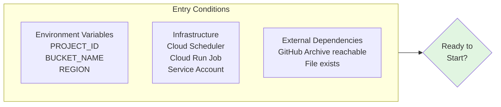

# Phase 1: Entry Conditions

```mermaid
graph LR
    subgraph Entry_Requirements [Entry Conditions]
        Env[Environment Variables<br/>PROJECT_ID<br/>BUCKET_NAME<br/>REGION]
        Infra[Infrastructure<br/>Cloud Scheduler<br/>Cloud Run Job<br/>Service Account]
        External[External Dependencies<br/>GitHub Archive reachable<br/>File exists]
    end

    Entry_Requirements --> Ready{Ready to<br/>Start?}

    style Ready fill:#e1f5e1
```
