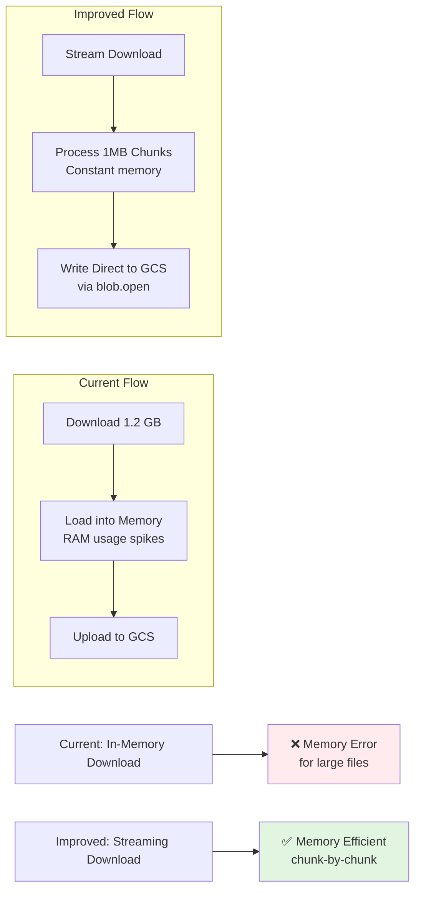

# Phase 1: Improvement Opportunities

```mermaid
flowchart LR
    Current[Current: In-Memory Download] --> Issue[❌ Memory Error<br/>for large files]

    Improved[Improved: Streaming Download] --> Fix[✅ Memory Efficient<br/>chunk-by-chunk]

    subgraph Current_Flow [Current Flow]
        Download[Download 1.2 GB] --> Memory[Load into Memory<br/>RAM usage spikes]
        Memory --> Upload[Upload to GCS]
    end

    subgraph Improved_Flow [Improved Flow]
        Stream[Stream Download] --> Chunks[Process 1MB Chunks<br/>Constant memory]
        Chunks --> Write[Write Direct to GCS<br/>via blob.open]
    end

    style Issue fill:#ffebee
    style Fix fill:#e1f5e1
```
