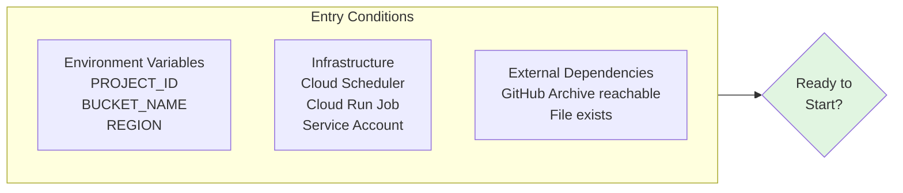
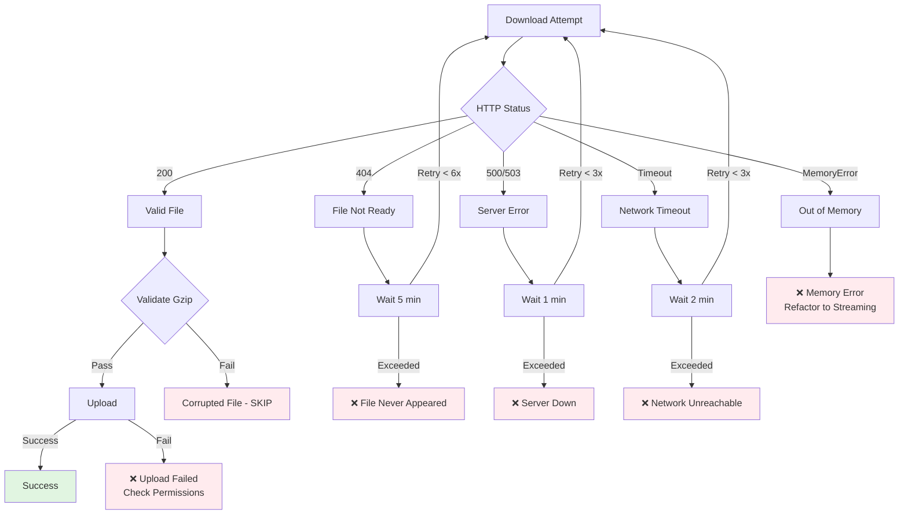
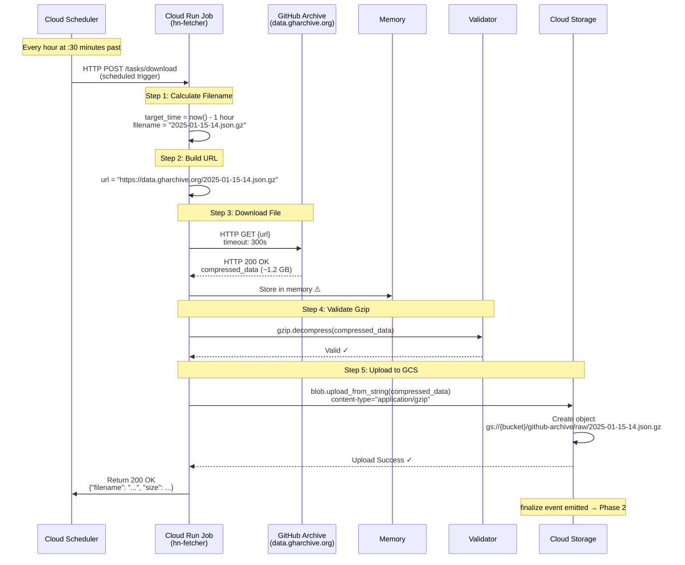
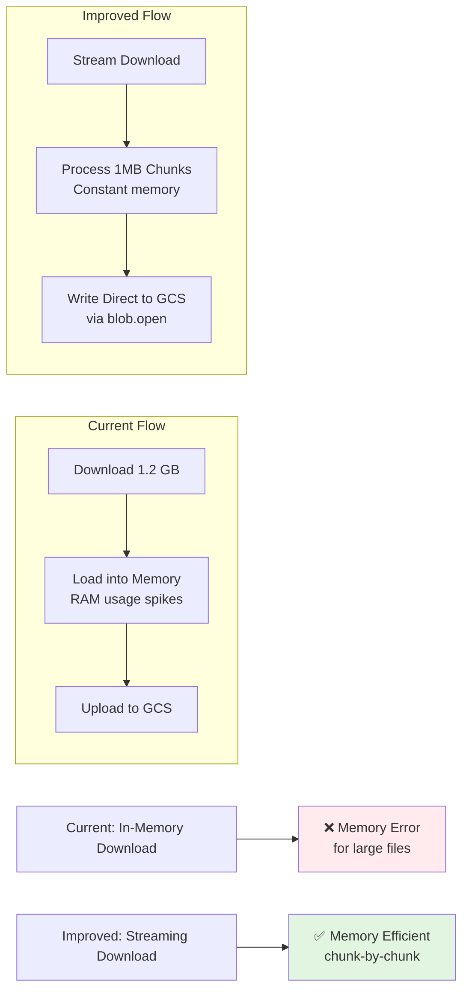

# Phase 1: Ingestion - Mermaid Diagram

## Main Flow Diagram

```mermaid
flowchart TD
    Start([Phase 1 Start]) --> Init[Initialize<br/>Environment Variables<br/>PROJECT_ID, BUCKET_NAME, REGION]

    subgraph Entry_Checks [Entry Conditions]
        E1[Scheduler deployed?<br/>cron: 30 * * * *]
        E2[Cloud Run Job deployed?<br/>hn-fetcher]
        E3[Service Account has<br/>Storage.ObjectCreator?]
        E4[GitHub Archive reachable?<br/>https://data.gharchive.org/]
    end

    Init --> Entry_Checks
    Entry_Checks -->|All Yes| CalcFilename[Step 1:<br/>Calculate Target Filename]
    Entry_Checks -->|Any No| FailEntry[❌ Entry Failed<br/>Fix Infrastructure]

    subgraph Step1 [Step 1: Calculate Filename]
        direction TB
        Calc1[Get current UTC time]
        Calc2[Subtract 1 hour]
        Calc3[Format: YYYY-MM-DD-H.json.gz]
        Calc4[Example:<br/>2025-01-15-14.json.gz]
        Calc1 --> Calc2 --> Calc3 --> Calc4
    end

    CalcFilename --> BuildURL[Step 2:<br/>Build Download URL<br/>https://data.gharchive.org/{filename}]

    subgraph Download [Step 3: Download File]
        direction TB
        HTTP[HTTP GET<br/>timeout: 300s]
        CheckStatus{Status = 200?}
        CheckStatus -->|Yes| ReadData[Read compressed_data<br/>~1.2 GB in memory ⚠️]
        CheckStatus -->|404| Wait404[Wait 5 min<br/>File not ready]
        CheckStatus -->|5xx| Wait5xx[Wait 1 min<br/>Server error]
        Wait404 -->|Retry| HTTP
        Wait5xx -->|Retry| HTTP
    end

    ReadData --> ValidateGzip[Step 4:<br/>Validate Gzip Format<br/>gzip.decompress]

    ValidateGzip -->|Valid| UploadGCS[Step 5:<br/>Upload to Cloud Storage<br/>bucket.blob.upload_from_string]
    ValidateGzip -->|BadGzipFile| FailValidate[❌ Corrupted File<br/>Skip & Log]

    subgraph Upload [Step 5: Upload to GCS]
        direction TB
        SetBlob[blob = bucket.blob<br/>github-archive/raw/{filename}]
        DoUpload[upload_from_string<br/>content_type=application/gzip]
        Verify{blob.exists?}
        DoUpload --> Verify
    end

    Verify -->|Yes| Success([✅ Phase 1 Success])
    Verify -->|No| FailUpload[❌ Upload Failed<br/>Check IAM/Network]

    Success --> Trigger[Triggers:<br/>Cloud Storage finalize event<br/>→ Phase 2]

    style Start fill:#e1f5e1
    style Success fill:#e1f5e1
    style FailEntry fill:#ffebee
    style FailValidate fill:#ffebee
    style FailUpload fill:#ffebee
    style Trigger fill:#fff3e0
```

---

## Entry Conditions Detail



---

## Exit Conditions Detail

```mermaid
graph TD
    subgraph Exit_Criteria [Exit Conditions - All Must Be True]
        EC1[✅ HTTP 200 from GitHub Archive]
        EC2[✅ Valid gzip format]
        EC3[✅ File exists in GCS]
        EC4[✅ Correct path:<br/>github-archive/raw/{filename}]
        EC5[✅ File integrity:<br/>blob.size == downloaded_size]
        EC6[✅ Correct MIME type:<br/>application/gzip]
        EC7[✅ No errors in logs]
    end

    Exit_Criteria --> Success{Phase 1<br/>Complete}

    Success --> Next[→ Phase 2:<br/>Eventarc Triggering]

    style Success fill:#e1f5e1
    style Next fill:#fff3e0
```

---

## Failure Scenarios



---

## Data Flow (Detailed)



---

## Component View

```mermaid
graph TB
    subgraph Phase1_Components [Phase 1 Components]
        direction TB
        Scheduler[Cloud Scheduler<br/>gcloud scheduler jobs<br/>schedule: 30 * * * *]

        Job[Cloud Run Job<br/>hn-fetcher<br/>Container: Python Flask<br/>Memory: 512Mi<br/>CPU: 1]

        Code[Source Code<br/>src/github_archive/main.py<br/>download_github_archive()<br/>Lines: 127-176]

        Storage[Cloud Storage<br/>Bucket: {project}-data-pipeline<br/>Path: github-archive/raw/]

        External[External<br/>GitHub Archive<br/>https://data.gharchive.org/]
    end

    External -.->|HTTP GET| Job
    Scheduler -.->|Scheduled Trigger| Job
    Job -.->|Uploads| Storage
    Code -.->|Implements| Job

    style Scheduler fill:#e3f2fd
    style Job fill:#bbdefb
    style Storage fill:#c8e6c9
    style External fill:#ffe0b2
```

---

## Improvement Opportunities


