# Infrastructure Deployment Visual Guide

Visual diagrams and quick reference for deploying the GitHub Archive data pipeline.

---

## 🎯 Quick Reference Deployment Order

```
1. Phase 1: Ingestion (Single Layer)
   ↓ (landing bucket created)
2. Phase 2: Processing (3 Layers: Static → First-Time → Operational)
   ↓ (staging bucket created)
3. Phase 3: Loading (3 Layers: Static → First-Time → Operational)
   ↓
4. Cloud Build (Phase 2 Application Code)
   ↓
5. Validation & Testing
```

---

## 📊 Complete Architecture Overview

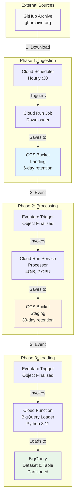

---

## 🔧 Terraform Layer Dependencies

### Phase 2 Layer Dependencies

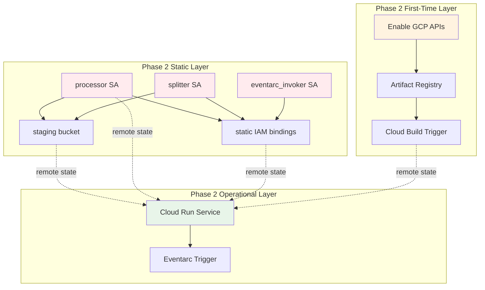

### Phase 3 Layer Dependencies

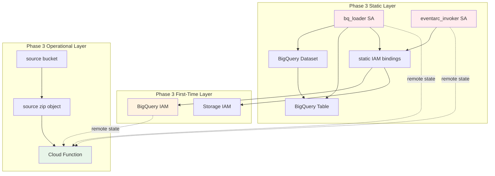

---

## 🔗 Cross-Phase Remote State Dependencies

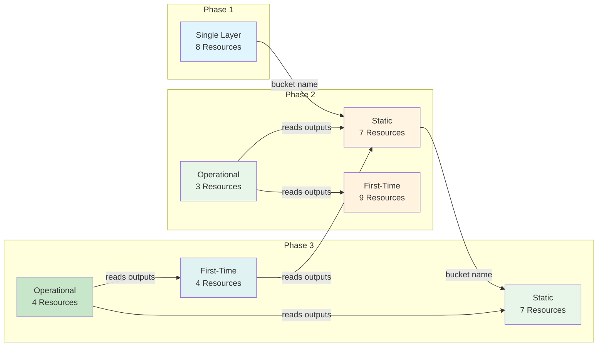

---

## 🚨 Critical Dependency Paths

### Must-Complete-First Dependencies

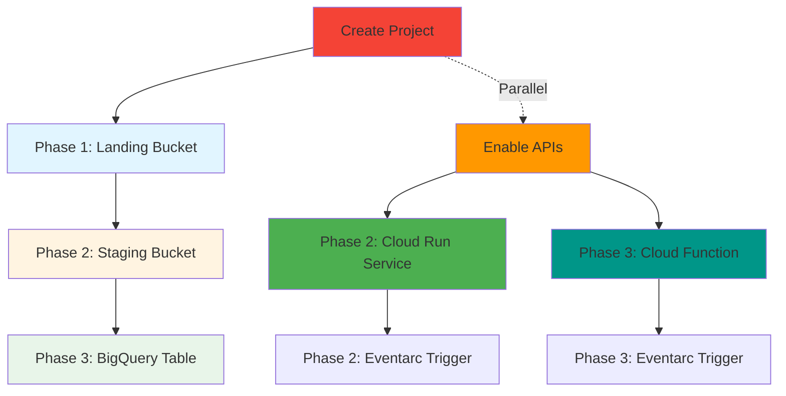

### IAM Permission Chain

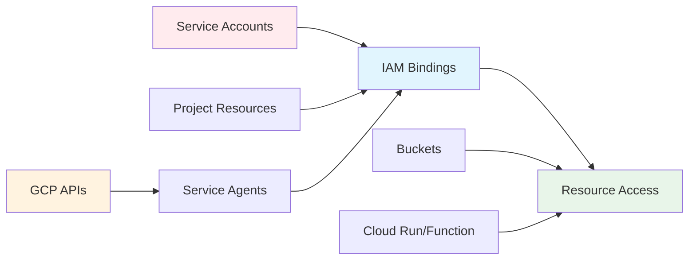

---

## ⏱️ Deployment Timeline with Dependencies

```mermaid
gantt
    title Infrastructure Deployment Timeline
    dateFormat X
    axisFormat %M min

    section Phase 1
    Service Accounts      :p1a, 0, 1
    Storage Bucket        :p1b, after p1a, 1
    Cloud Run Job         :p1c, after p1a, 2
    Cloud Scheduler       :p1d, after p1c, 1

    section Phase 2
    Static Resources      :p2a, after p1d, 2
    First-Time Setup      :p2b, after p2a, 3
    Cloud Run Service     :p2c, after p2b, 3
    Eventarc Trigger      :p2d, after p2c, 1

    section Phase 3
    Static Resources      :p3a, after p2d, 2
    First-Time Setup      :p3b, after p3a, 2
    Cloud Function        :p3c, after p3b, 4
    Eventarc Trigger      :p3d, after p3c, 1

    section Application
    Cloud Build           :cb, after p2d, 5
    Validation            :val, after p3d, 4
```

---

## 🎯 Resource Creation Checklist

### Phase 1: Ingestion ✓

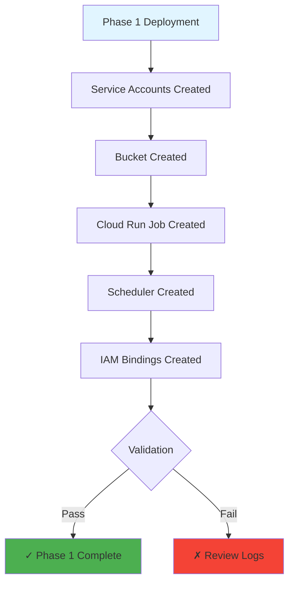

### Phase 2: Processing ✓

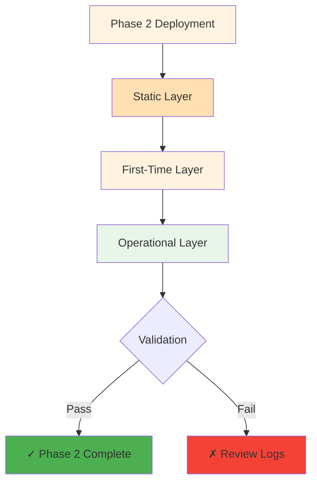

### Phase 3: Loading ✓

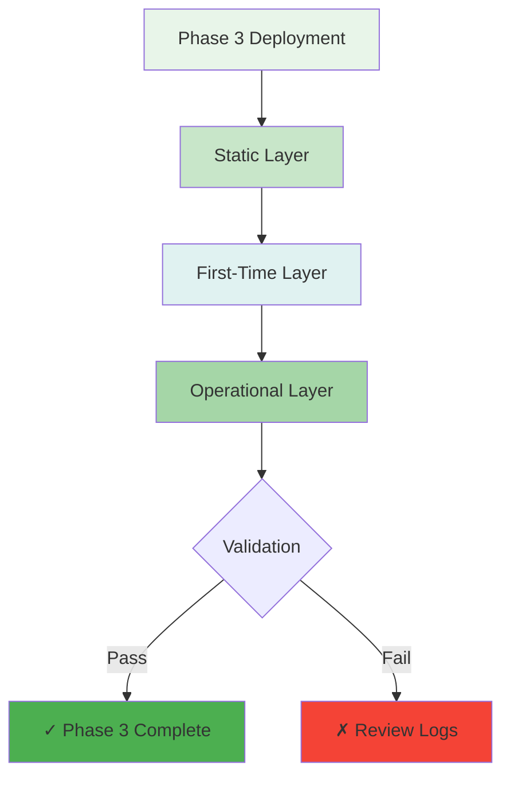

---

## 🔍 Variable Flow Diagram

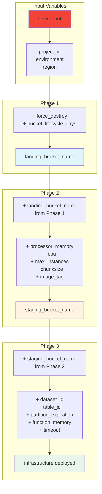

---

## 📊 Resource Count by Layer

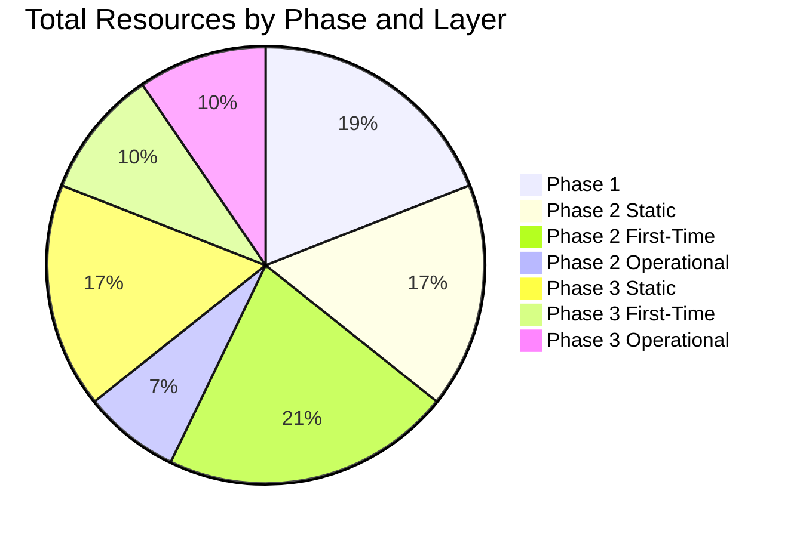

**Total: 42 Terraform Resources**

---

## 🎯 Deployment Decision Tree

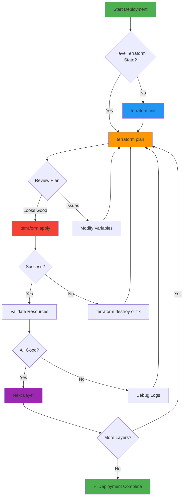

---

## 🚨 Rollback Strategy

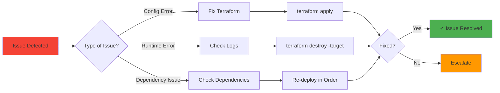

---

## 📚 Quick Reference Commands

### Terraform Operations
```bash
# Initialize (first time)
terraform init

# Plan with variables
terraform plan \
  -var="project_id=$PROJECT_ID" \
  -var="environment=$ENVIRONMENT" \
  -var="region=$REGION"

# Apply changes
terraform apply \
  -var="project_id=$PROJECT_ID" \
  -var="environment=$ENVIRONMENT" \
  -var="region=$REGION"

# Destroy resources (if needed)
terraform destroy \
  -var="project_id=$PROJECT_ID" \
  -var="environment=$ENVIRONMENT" \
  -var="region=$REGION"

# Show state
terraform show

# Refresh state
terraform refresh
```

### Validation Commands
```bash
# Check Cloud Run services
gcloud run services list --project=$PROJECT_ID

# Check Cloud Run jobs
gcloud run jobs list --project=$PROJECT_ID

# Check Cloud Functions
gcloud functions list --project=$PROJECT_ID

# Check BigQuery datasets
bq ls --project_id=$PROJECT_ID -d

# Check GCS buckets
gsutil ls

# Check Eventarc triggers
gcloud eventarc triggers list --project=$PROJECT_ID
```

---

`✶ Insight ─────────────────────────────────────`
**Visual Dependency Management:** These Mermaid diagrams provide a complete visual representation of your infrastructure dependencies. The layered architecture is clearly visible across multiple diagrams showing how resources depend on each other both within phases (via remote state) and across phases (via bucket names passed as variables).

**Deployment Confidence:** By following the dependency graphs and deployment order, you can deploy with confidence knowing that all prerequisites will be met. The visual checklist diagrams help validate each layer before proceeding to the next, reducing deployment failures and debugging time.
`─────────────────────────────────────────────────`
