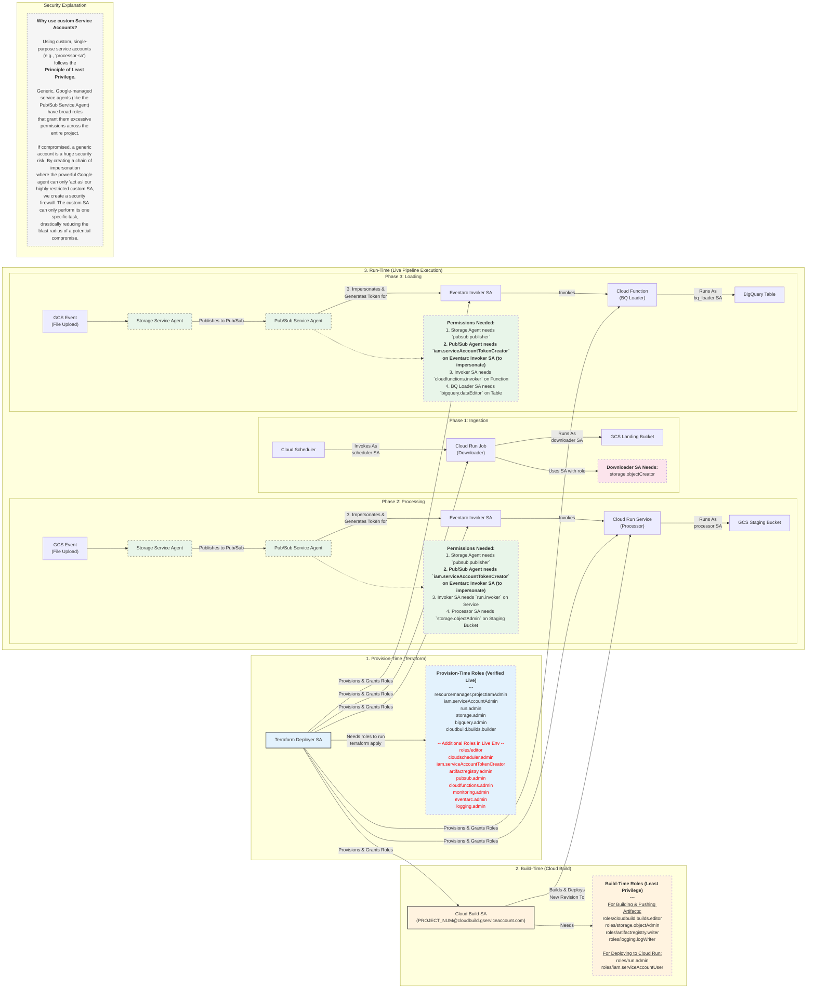

# IAM Permissions and Dependency Flow

This diagram provides a comprehensive visualization of the service accounts, roles, and dependencies across the three distinct stages of the pipeline's lifecycle: Provision-Time, Build-Time, and Run-Time.

## Complete Permissions and Dependency Flow

This file is now saved as `docs/IAM_DEPENDENCY_FLOW.md` and can be referenced by the team to understand the complete permissions model.
