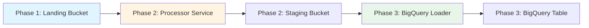
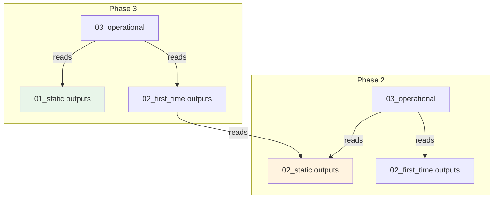

# Terraform Resource Dependency Matrix

Complete breakdown of all resources, their requirements, and deployment dependencies.

---

## 📊 Complete Resource Inventory

### Phase 1: Ingestion (8 Resources)

| Resource Name | Type | Requires | Created By | Layer |
|---------------|------|----------|------------|-------|
| `github_archive_landing` | Storage Bucket | Project ID | Terraform | Static |
| `github_archive_downloader` | Cloud Run Job | Service Account, Landing Bucket | Terraform | Static |
| `github_archive_download` | Cloud Scheduler Job | Cloud Run Job URL, Service Account | Terraform | Static |
| `github_archive_downloader` (SA) | Service Account | Project ID | Terraform | Static |
| `scheduler` (SA) | Service Account | Project ID | Terraform | Static |
| `github_archive_downloader_storage` | IAM Binding | Service Account, Project | Terraform | Static |
| `github_archive_downloader_logging` | IAM Binding | Service Account, Project | Terraform | Static |
| `scheduler_github_invoker` | IAM Binding | Scheduler SA, Cloud Run Job | Terraform | Static |

### Phase 2: Processing (18 Resources)

#### Static Layer (7 Resources)
| Resource Name | Type | Requires | External Dependency |
|---------------|------|----------|---------------------|
| `processor` (SA) | Service Account | Project ID | None |
| `splitter` (SA) | Service Account | Project ID | None |
| `eventarc_invoker` (SA) | Service Account | Project ID | None |
| `staging` | Storage Bucket | Service Accounts | None |
| 3x Logging IAM | IAM Bindings | Service Accounts | logging.googleapis.com |
| 3x Monitoring IAM | IAM Bindings | Service Accounts | monitoring.googleapis.com |
| 2x Storage IAM | IAM Bindings | Service Accounts, Buckets | None |

#### First-Time Layer (9 Resources)
| Resource Name | Type | Requires | External Dependency |
|---------------|------|----------|---------------------|
| 9x GCP APIs | Project Services | Project ID | - |
| `docker_repo` | Artifact Registry | Project ID | artifactregistry.googleapis.com |
| `phase2_processor` | Cloud Build Trigger | Project ID, Repository | cloudbuild.googleapis.com |
| `cloudbuild_sa` | Service Account | Project ID | - |
| 5x Cloud Build IAM | IAM Bindings | Service Account, Project | Various APIs |
| `storage_pubsub_publisher` | IAM Binding | Service Agent | pubsub.googleapis.com |
| `eventarc_event_receiver` | IAM Binding | Service Agent | eventarc.googleapis.com |

#### Operational Layer (3 Resources)
| Resource Name | Type | Requires | Dependency Source |
|---------------|------|----------|-------------------|
| `processor` (Service) | Cloud Run | Image, Service Account | Artifact Registry, Static Layer |
| `storage_events` | Eventarc | Cloud Run Service, Bucket | Static Layer (SA, Bucket) |
| `eventarc_invoker_processor` | IAM Binding | Eventarc SA, Cloud Run | Static Layer |

### Phase 3: Loading (15 Resources)

#### Static Layer (7 Resources)
| Resource Name | Type | Requires | External Dependency |
|---------------|------|----------|---------------------|
| `github_archive` | BigQuery Dataset | Project ID | bigquery.googleapis.com |
| `github_events` | BigQuery Table | Dataset ID | bigquery.googleapis.com |
| `bq_loader` (SA) | Service Account | Project ID | - |
| `eventarc_invoker` (SA) | Service Account | Project ID | - |
| 4x BigQuery IAM | IAM Bindings | Service Account, Dataset | bigquery.googleapis.com |
| 2x Logging/Monitoring IAM | IAM Bindings | Service Account | Logging/Monitoring APIs |

#### First-Time Layer (4 Resources)
| Resource Name | Type | Requires | Dependency Source |
|---------------|------|----------|-------------------|
| `bq_loader_data_editor` | BigQuery IAM | Service Account, Dataset | Static Layer |
| `bq_loader_job_user` | BigQuery IAM | Service Account, Project | Static Layer |
| `bq_loader_staging_viewer` | Storage IAM | Service Account, Bucket | Static Layer (Phase 2!) |
| `bq_loader_staging_admin` | Storage IAM | Service Account, Bucket | Static Layer (Phase 2!) |

#### Operational Layer (4 Resources)
| Resource Name | Type | Requires | Dependency Source |
|---------------|------|----------|-------------------|
| `source` | Storage Bucket | Project ID | - |
| `source` (Object) | GCS Object | Zip file, Bucket | - |
| `bq_loader` (Function) | Cloud Function 2nd Gen | Bucket, Service Account | Static Layer |
| `gcs_pubsub_publisher` | IAM Binding | Service Agent | pubsub.googleapis.com |

---

## 🔗 Cross-Phase Dependencies

### Data Flow Dependencies


### Terraform Remote State Dependencies


---

## 📋 Variable Dependencies

### Required Variables Flow

```
┌─────────────────────────────────────────────────────────────┐
│ User Input Variables                                        │
├─────────────────────────────────────────────────────────────┤
│ • project_id: your-test-project                            │
│ • environment: test                                         │
│ • region: us-central1                                       │
└─────────────────────────────────────────────────────────────┘
         │
         ▼
┌─────────────────────────────────────────────────────────────┐
│ Phase 1 Variables                                           │
├─────────────────────────────────────────────────────────────┤
│ • project_id ✅                                            │
│ • environment ✅                                            │
│ • region ✅                                                 │
│ • force_destroy ✅                                          │
│ • bucket_lifecycle_days ✅                                  │
└─────────────────────────────────────────────────────────────┘
         │ Output: landing_bucket_name
         ▼
┌─────────────────────────────────────────────────────────────┐
│ Phase 2 Variables                                           │
├─────────────────────────────────────────────────────────────┤
│ • project_id ✅                                            │
│ • environment ✅                                            │
│ • region ✅                                                 │
│ • landing_bucket_name (from Phase 1) ⚠️                   │
│ • staging_retention_days ✅                                │
│ • processor_memory ✅                                       │
│ • processor_cpu ✅                                          │
│ • max_instances ✅                                          │
│ • chunksize ✅                                               │
│ • image_tag ✅                                              │
│ • eventarc_ack_deadline_seconds ✅                          │
└─────────────────────────────────────────────────────────────┘
         │ Output: staging_bucket_name
         ▼
┌─────────────────────────────────────────────────────────────┐
│ Phase 3 Variables                                           │
├─────────────────────────────────────────────────────────────┤
│ • project_id ✅                                            │
│ • environment ✅                                            │
│ • region ✅                                                 │
│ • staging_bucket_name (from Phase 2) ⚠️                   │
│ • dataset_id ✅                                             │
│ • table_id ✅                                               │
│ • partition_expiration_days ✅                              │
│ • function_memory ✅                                        │
│ • function_timeout ✅                                       │
│ • max_instances ✅                                          │
│ • delete_after_load ✅                                      │
└─────────────────────────────────────────────────────────────┘
```

---

## ⚠️ Critical Dependencies

### Must Exist Before Deployment

1. **Google Cloud Project**
   - Must be created
   - Billing enabled
   - APIs enabled (Phase 2 First-Time does this)

2. **Service Account for Terraform**
   - For deployments (if not using personal account)
   - Roles: Owner, Editor, or custom roles with:
     - Service Account Admin
     - Cloud Run Admin
     - BigQuery Admin
     - Storage Admin
     - Cloud Build Service Account
     - Service Usage Admin

3. **Terraform State Backend**
   - GCS bucket for state storage
   - Permissions for service account

### Cross-Phase Bucket Dependencies

| Bucket | Created By | Used By | Variable Name |
|--------|------------|---------|---------------|
| `{project}-{env}-github-archive-landing` | Phase 1 | Phase 2 | `landing_bucket_name` |
| `{project}-{env}-github-archive-staging` | Phase 2 | Phase 3 | `staging_bucket_name` |

### Service Account Dependencies

| Service Account | Created By | Used By | Purpose |
|-----------------|------------|---------|---------|
| `scheduler` | Phase 1 | Phase 1 | Invokes Cloud Run Job |
| `github_archive_downloader` | Phase 1 | Phase 1 | Runs downloader job |
| `processor` | Phase 2 | Phase 2 | Runs processor service |
| `eventarc_invoker` | Phase 2 | Phase 2 | Invokes Cloud Run |
| `bq_loader` | Phase 3 | Phase 3 | Loads data to BigQuery |
| `eventarc_invoker` | Phase 3 | Phase 3 | Invokes Cloud Function |

---

## 🔄 Deployment Order Constraints

### Hard Constraints (Must Follow)

1. **Phase 1 must complete before Phase 2**
   - Phase 2 needs `landing_bucket_name` from Phase 1
   - Eventarc trigger references Phase 1 bucket

2. **Phase 2 must complete before Phase 3**
   - Phase 3 needs `staging_bucket_name` from Phase 2
   - Eventarc trigger references Phase 2 bucket

3. **Within Phase 2: Static → First-Time → Operational**
   - Static creates service accounts and buckets
   - First-Time enables APIs
   - Operational creates services that depend on above

4. **Within Phase 3: Static → First-Time → Operational**
   - Static creates BigQuery resources
   - First-Time sets up IAM
   - Operational creates function that depends on above

### Soft Constraints (Recommended)

1. **Validate after each phase**
   - Catch configuration errors early
   - Ensure resources are created successfully

2. **Test data flow after deployment**
   - Phase 1: Verify scheduler triggers job
   - Phase 2: Verify Eventarc trigger fires
   - Phase 3: Verify function loads data

3. **Cloud Build after all Terraform**
   - Infrastructure must exist first
   - Cloud Run service must be deployed
   - Artifact Registry must exist

---

## 🎯 Deployment Scenarios

### Scenario 1: Fresh Deployment (Greenfield)

**Order:**
1. Phase 1 (All at once - single layer)
2. Phase 2 Static → First-Time → Operational
3. Phase 3 Static → First-Time → Operational
4. Cloud Build (Phase 2 only)
5. Manual test with sample data

**Time:** 20-30 minutes

### Scenario 2: Infrastructure Update

**Order:**
1. Identify which phase changed
2. Deploy only affected layers
3. Skip unchanged layers
4. Validate affected resources

**Time:** 5-10 minutes (if only operational layer)

### Scenario 3: Disaster Recovery

**Order:**
1. Ensure Terraform state is available
2. Deploy all phases in order
3. Import any existing resources if needed
4. Validate data flow

**Time:** 30-45 minutes (including potential import)

---

## 🔍 Dependency Validation Commands

### Pre-Deployment Validation

```bash
# Check project access
gcloud projects describe your-test-project

# Check required APIs (Phase 2 enables these)
gcloud services list \
  --project=your-test-project \
  --filter="state.ENABLED"

# Check Terraform backend
gsutil ls gs://your-terraform-state-bucket/terraform/state/
```

### Post-Phase Validation

```bash
# After Phase 1
gsutil ls gs://your-test-project-test-github-archive-landing/
gcloud run jobs list --project=your-test-project

# After Phase 2
gsutil ls gs://your-test-project-test-github-archive-staging/
gcloud run services describe test-github-archive-processor \
  --project=your-test-project --region=us-central1

# After Phase 3
bq ls --project_id=your-test-project -d github_archive
gcloud functions describe test-bq-loader \
  --project=your-test-project --region=us-central1
```

---

## 📊 Resource Creation Timeline

```
Time 0:00 ──────────────────────────────────────────────────────►
         Phase 1: Ingestion
         ├─ Service Accounts (0:30)
         ├─ Storage Bucket (0:45)
         ├─ Cloud Run Job (1:00)
         └─ Cloud Scheduler (0:30)
         Total: ~2 min

Time 0:02 ──────────────────────────────────────────────────────►
         Phase 2: Processing
         ├─ Static Layer (1:00)
         │  ├─ Service Accounts
         │  ├─ Storage Bucket
         │  └─ IAM Bindings
         ├─ First-Time Layer (2:30)
         │  ├─ GCP APIs (2:00)
         │  ├─ Artifact Registry (0:15)
         │  └─ Cloud Build (0:15)
         └─ Operational Layer (2:00)
            ├─ Cloud Run Service (1:30)
            └─ Eventarc Trigger (0:30)
         Total: ~6 min

Time 0:08 ──────────────────────────────────────────────────────►
         Phase 3: Loading
         ├─ Static Layer (1:00)
         │  ├─ BigQuery Dataset (0:30)
         │  ├─ BigQuery Table (0:15)
         │  └─ Service Accounts (0:15)
         ├─ First-Time Layer (1:30)
         │  └─ IAM Bindings
         └─ Operational Layer (3:00)
            ├─ GCS Buckets (0:30)
            ├─ Source Object (0:15)
            └─ Cloud Function (2:15)
         Total: ~6 min

Time 0:14 ──────────────────────────────────────────────────────►
         Cloud Build: Phase 2
         ├─ Docker Build (3:00)
         ├─ Push to Registry (1:00)
         └─ Deploy to Cloud Run (1:00)
         Total: ~5 min

Time 0:19 ──────────────────────────────────────────────────────►
         Validation & Testing
         ├─ Manual Trigger Test (2:00)
         ├─ Log Verification (1:00)
         └─ Data Flow Test (1:00)
         Total: ~4 min

Time 0:23 ──────────────────────────────────────────────────────►
         COMPLETE ✓
```

---

`✶ Insight ─────────────────────────────────────`
**Dependency Management Strategy:** The layered architecture (Static → First-Time → Operational) is a best practice that separates concerns by change frequency. Static resources (buckets, service accounts) change rarely. First-Time setup (APIs, repositories) happens once. Operational resources (services, triggers) change frequently during development. This minimizes blast radius and speeds up deployments.

**Cross-Phase Bucket Pattern:** The landing → staging → BigQuery flow is implemented via bucket names passed as variables. This loose coupling allows phases to be deployed independently while maintaining the data pipeline. Each phase "owns" its bucket but only needs the bucket name from the previous phase, not direct resource references.
`─────────────────────────────────────────────────`
