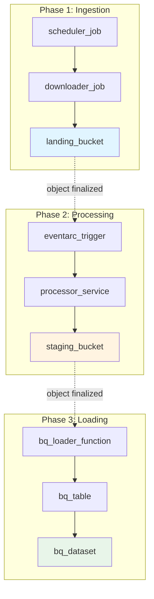
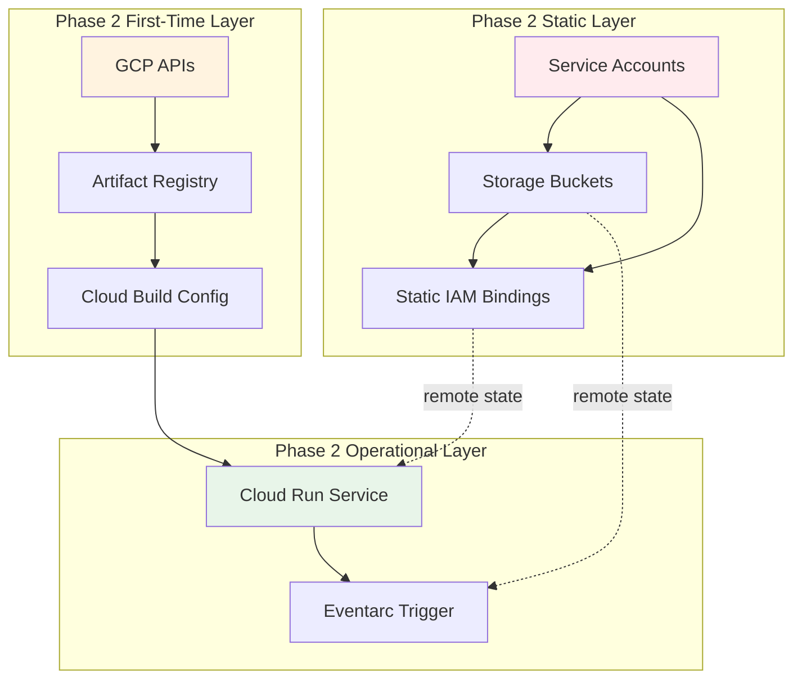
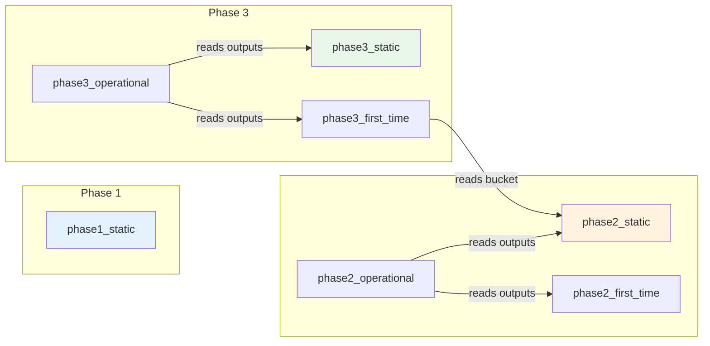

# Terraform Deployment Guide - GitHub Archive Infrastructure

## 📋 Overview

This guide provides a complete deployment strategy for the GitHub Archive data pipeline infrastructure across 3 phases, including dependency analysis, deployment order, and integration with Cloud Build.

---

## 🏗️ Infrastructure Architecture

### Data Flow
```
┌─────────────────┐
│  GitHub Archive │
│  (gharchive.org) │
└────────┬────────┘
         │ 1. Download (Hourly)
         ▼
┌─────────────────────────────────────────────────────────────────┐
│ PHASE 1: Ingestion                                             │
│ • Cloud Scheduler Job → Cloud Run Job (Downloader)             │
│ • Downloads: 2026-03-10-18.json.gz to GCS                      │
│ • Landing Bucket: dev-{env}-github-archive-landing              │
│ • Retention: 6 days                                            │
└─────────────────────────────────────────────────────────────────┘
         │ 2. Object Finalized Event
         ▼
┌─────────────────────────────────────────────────────────────────┐
│ PHASE 2: Processing                                            │
│ • Eventarc Trigger → Cloud Run Service (Processor)             │
│ • Validates, transforms, chunks large files                    │
│ • Staging Bucket: dev-{env}-github-archive-staging              │
│ • Retention: 30 days                                           │
└─────────────────────────────────────────────────────────────────┘
         │ 3. Object Finalized Event
         ▼
┌─────────────────────────────────────────────────────────────────┐
│ PHASE 3: Loading                                               │
│ • Eventarc Trigger → Cloud Function (BigQuery Loader)          │
│ • Loads NDJSON files to BigQuery table                         │
│ • Dataset: github_archive                                       │
│ • Table: github_events (partitioned by created_at)             │
└─────────────────────────────────────────────────────────────────┘
```

---

## 📊 Resource Inventory

### Phase 1: Ingestion (8 resources)

| Resource | Type | Purpose | Layer |
|----------|------|---------|-------|
| `github_archive_landing` | Storage Bucket | Raw GitHub Archive files | Static |
| `github_archive_downloader` | Cloud Run Job | Downloads from gharchive.org | Static |
| `github_archive_download` | Cloud Scheduler Job | Hourly trigger at :30 past | Static |
| `github_archive_downloader` | Service Account | Downloader identity | Static |
| `scheduler` | Service Account | Scheduler identity | Static |
| 4x IAM bindings | IAM Permissions | Storage, Logging, Invoker | Static |

### Phase 2: Processing (18 resources)

| Resource | Type | Purpose | Layer |
|----------|------|---------|-------|
| `staging` | Storage Bucket | Processed files | Static |
| `processor` | Service Account | Processor identity | Static |
| `eventarc_invoker` | Service Account | Eventarc trigger identity | Static |
| 9x GCP APIs | Project Services | Enable required APIs | First-Time |
| `docker_repo` | Artifact Registry | Container images | First-Time |
| `phase2_processor` | Cloud Build Trigger | Manual deployment | First-Time |
| `processor` | Cloud Run Service | Main processing service | Operational |
| `storage_events` | Eventarc Trigger | GCS → Cloud Run | Operational |
| 6x IAM bindings | IAM Permissions | Multi-service access | All Layers |

### Phase 3: Loading (15 resources)

| Resource | Type | Purpose | Layer |
|----------|------|---------|-------|
| `github_archive` | BigQuery Dataset | Target dataset | Static |
| `github_events` | BigQuery Table | Partitioned table | Static |
| `bq_loader` | Service Account | Loader identity | Static |
| `eventarc_invoker` | Service Account | Eventarc identity | Static |
| 7x IAM bindings | IAM Permissions | BQ, Storage, Logging | Static/First-Time |
| `source` | Storage Bucket | Function code | Operational |
| `bq_loader` | Cloud Function 2nd Gen | Loads data to BigQuery | Operational |
| 2x IAM bindings | IAM Permissions | Eventarc, Pub/Sub | Operational |

---

## 🔗 Dependency Graph (Mermaid)

### Cross-Phase Dependencies


### Phase 2 Layer Dependencies


### Terraform Remote State Dependencies


---

## 🎯 Recommended Deployment Order

### Option A: Sequential Phase Deployment (RECOMMENDED)

#### Step 1: Deploy Phase 1 - Ingestion
```bash
cd infrastructure/github_archive/phase1_ingestion/terraform

# Initialize (first time only)
terraform init

# Plan deployment
terraform plan \
  -var="project_id=your-test-project" \
  -var="environment=test" \
  -var="region=us-central1"

# Apply
terraform apply \
  -var="project_id=your-test-project" \
  -var="environment=test" \
  -var="region=us-central1"
```

**What gets created:**
- ✅ Landing bucket
- ✅ Downloader Cloud Run Job
- ✅ Cloud Scheduler Job (hourly)
- ✅ Service accounts and IAM

**Validation:**
```bash
# Check bucket exists
gsutil ls gs://your-test-project-test-github-archive-landing

# Check Cloud Run Job
gcloud run jobs list --project=your-test-project --filter="github-archive"

# Check Scheduler
gcloud scheduler jobs list --project=your-test-project --location=us-central1
```

---

#### Step 2: Deploy Phase 2 - Processing

**Layer 01: Static Resources**
```bash
cd infrastructure/github_archive/phase2_process_files/terraform/layers/01_static

terraform init
terraform plan \
  -var="project_id=your-test-project" \
  -var="environment=test" \
  -var="region=us-central1" \
  -var="landing_bucket_name=your-test-project-test-github-archive-landing"

terraform apply \
  -var="project_id=your-test-project" \
  -var="environment=test" \
  -var="region=us-central1" \
  -var="landing_bucket_name=your-test-project-test-github-archive-landing"
```

**Layer 02: First-Time Setup**
```bash
cd ../02_first_time

terraform init
terraform plan \
  -var="project_id=your-test-project" \
  -var="environment=test" \
  -var="region=us-central1"

terraform apply \
  -var="project_id=your-test-project" \
  -var="environment=test" \
  -var="region=us-central1"
```

**Layer 03: Operational Resources**
```bash
cd ../03_operational

terraform init
terraform plan \
  -var="project_id=your-test-project" \
  -var="environment=test" \
  -var="region=us-central1" \
  -var="image_tag=latest"

terraform apply \
  -var="project_id=your-test-project" \
  -var="environment=test" \
  -var="region=us-central1" \
  -var="image_tag=latest"
```

**Validation:**
```bash
# Check staging bucket
gsutil ls gs://your-test-project-test-github-archive-staging

# Check Cloud Run Service
gcloud run services describe test-github-archive-processor \
  --project=your-test-project \
  --region=us-central1

# Check Eventarc trigger
gcloud eventarc triggers list \
  --project=your-test-project \
  --region=us-central1
```

---

#### Step 3: Deploy Phase 3 - Loading

**Layer 01: Static Resources**
```bash
cd infrastructure/github_archive/phase3_loadbigquery/terraform/layers/01_static

terraform init
terraform plan \
  -var="project_id=your-test-project" \
  -var="environment=test" \
  -var="region=us-central1"

terraform apply \
  -var="project_id=your-test-project" \
  -var="environment=test" \
  -var="region=us-central1"
```

**Layer 02: First-Time Setup**
```bash
cd ../02_first_time

terraform init
terraform plan \
  -var="project_id=your-test-project" \
  -var="environment=test" \
  -var="region=us-central1" \
  -var="staging_bucket_name=your-test-project-test-github-archive-staging"

terraform apply \
  -var="project_id=your-test-project" \
  -var="environment=test" \
  -var="region=us-central1" \
  -var="staging_bucket_name=your-test-project-test-github-archive-staging"
```

**Layer 03: Operational Resources**
```bash
cd ../03_operational

terraform init
terraform plan \
  -var="project_id=your-test-project" \
  -var="environment=test" \
  -var="region=us-central1"

terraform apply \
  -var="project_id=your-test-project" \
  -var="environment=test" \
  -var="region=us-central1"
```

**Validation:**
```bash
# Check BigQuery dataset
bq --project_id=your-test-project ls -d github_archive

# Check table
bq --project_id=your-test-project show github_archive.github_events

# Check Cloud Function
gcloud functions describe test-bq-loader \
  --project=your-test-project \
  --region=us-central1
```

---

### Option B: Layer-by-Layer Deployment (Alternative)

If you want to deploy all infrastructure layer by layer across all phases:

```bash
# Step 1: Deploy all Static layers (Phase 1, 2, 3)
terraform apply -chdir=infrastructure/github_archive/phase1_ingestion/terraform
terraform apply -chdir=infrastructure/github_archive/phase2_process_files/terraform/layers/01_static
terraform apply -chdir=infrastructure/github_archive/phase3_loadbigquery/terraform/layers/01_static

# Step 2: Deploy all First-Time layers
terraform apply -chdir=infrastructure/github_archive/phase2_process_files/terraform/layers/02_first_time
terraform apply -chdir=infrastructure/github_archive/phase3_loadbigquery/terraform/layers/02_first_time

# Step 3: Deploy all Operational layers
terraform apply -chdir=infrastructure/github_archive/phase2_process_files/terraform/layers/03_operational
terraform apply -chdir=infrastructure/github_archive/phase3_loadbigquery/terraform/layers/03_operational
```

---

## 🐳 Cloud Build Deployment Order

After Terraform infrastructure is deployed, deploy the application code:

### Phase 2: Cloud Run Service

```bash
cd src/github_archive/phase2_process_files

# Option 1: Trigger Cloud Build manually
gcloud builds submit --config=cloudbuild.yaml . \
  --substitutions=_REGION=us-central1,_ENVIRONMENT=test

# Option 2: Use Cloud Build trigger (created in Phase 2 First-Time)
gcloud builds triggers run phase2-processor \
  --project=your-test-project \
  --region=us-central1
```

**What Cloud Build does:**
1. Builds Docker image using `Dockerfile.processor`
2. Pushes to Artifact Registry
3. Deploys to Cloud Run service

**Validation after Cloud Build:**
```bash
# Check service revision
gcloud run services revisions list test-github-archive-processor \
  --project=your-test-project \
  --region=us-central1 \
  --limit=1

# Check service logs
gcloud logging logs tail \
  --project=your-test-project \
  --resource=projects/your-test-project/locations/us-central1/services/test-github-archive-processor
```

---

### Phase 3: Cloud Function

The Cloud Function source code is packaged by Terraform (see `terraform/layers/03_operational/main.tf`). No separate Cloud Build needed.

**Validation:**
```bash
# Check function deployment
gcloud functions describe test-bq-loader \
  --project=your-test-project \
  --region=us-central1

# Check function logs
gcloud functions logs read test-bq-loader \
  --project=your-test-project \
  --region=us-central1 \
  --limit=50
```

---

## ✅ Pre-Deployment Checklist

### Prerequisites
- [ ] Google Cloud project created and accessible
- [ ] `gcloud` CLI installed and authenticated
- [ ] Project ID confirmed
- [ ] Terraform installed (`terraform version`)
- [ ] Service account key for Terraform deployments (optional)

### Project Setup
```bash
# Set your project
export PROJECT_ID="your-test-project"
gcloud config set project $PROJECT_ID

# Enable required APIs (Phase 2 will do this, but can enable upfront)
gcloud services enable \
    cloudresourcemanager.googleapis.com \
    cloudbuild.googleapis.com \
    run.googleapis.com \
    bigquery.googleapis.com \
    storage.googleapis.com \
    eventarc.googleapis.com \
    cloudfunctions.googleapis.com \
    iam.googleapis.com \
    logging.googleapis.com \
    monitoring.googleapis.com
```

### Terraform Backend Configuration
Ensure Terraform state is configured (check `terraform.tf` in each phase):

```hcl
terraform {
  backend "gcs" {
    bucket = "your-terraform-state-bucket"
    prefix = "terraform/state/github-archive"
  }
}
```

---

## 🔍 Post-Deployment Validation

### End-to-End Pipeline Test

```bash
# 1. Manually trigger Phase 1 downloader
gcloud run jobs execute test-github-archive-download-gsutil \
  --project=your-test-project \
  --region=us-central1

# 2. Check landing bucket
gsutil ls gs://your-test-project-test-github-archive-landing/github-archive/raw/

# 3. Check Cloud Run logs for processing
gcloud logging logs tail \
  --resource=projects/your-test-project/locations/us-central1/services/test-github-archive-processor \
  --filter="severity>=INFO" \
  --limit=50

# 4. Check staging bucket
gsutil ls gs://your-test-project-test-github-archive-staging/

# 5. Check BigQuery table
bq query --project_id=your-test-project \
  "SELECT COUNT(*) as row_count FROM github_archive.github_events"
```

---

## 🚨 Troubleshooting

### Common Issues

#### Issue 1: Remote State Not Found
**Error:** `Failed to retrieve state from remote backend`

**Solution:**
```bash
# Ensure backend bucket exists
gsutil mb -p your-test-project gs://your-terraform-state-bucket

# Initialize with backend
terraform init
```

#### Issue 2: Permission Denied on Cloud Run
**Error:** `PERMISSION_DENIED: Permission 'run.services.get' denied`

**Solution:**
```bash
# Grant Cloud Run Admin role
gcloud projects add-iam-policy-binding your-test-project \
  --member=serviceAccount:PROJECT_NUMBER-compute@developer.gserviceaccount.com \
  --role=roles/run.admin
```

#### Issue 3: Eventarc Trigger Not Firing
**Error:** Eventarc trigger created but no events received

**Solution:**
```bash
# Check Pub/Sub permissions
gcloud projects add-iam-policy-binding your-test-project \
  --member=serviceAccount:service-PROJECT_NUMBER@gcp-sa-eventarc.iam.gserviceaccount.com \
  --role=roles/pubsub.subscriber

# Check event trigger status
gcloud eventarc triggers describe STORAGE_EVENTS \
  --project=your-test-project \
  --region=us-central1
```

---

## 📊 Resource Dependencies Summary

| Phase | Layer | Resources | Dependencies | Time to Deploy |
|-------|-------|-----------|--------------|----------------|
| **Phase 1** | Single | 8 | None | ~2 min |
| **Phase 2** | Static | 7 | Phase 1 bucket name | ~1 min |
| **Phase 2** | First-Time | 9 | Static layer outputs | ~3 min |
| **Phase 2** | Operational | 3 | Static + First-Time outputs | ~2 min |
| **Phase 3** | Static | 7 | Phase 2 bucket name | ~1 min |
| **Phase 3** | First-Time | 4 | Static layer outputs | ~2 min |
| **Phase 3** | Operational | 4 | Static + First-Time outputs | ~3 min |
| **Cloud Build** | - | 2 images | Phase 2 resources exist | ~5 min |

**Total Estimated Time:** ~20-25 minutes for full deployment

---

## 🎯 Key Recommendations

1. **Deploy Sequentially by Phase** - Recommended for first deployment
2. **Validate After Each Phase** - Catch issues early
3. **Use Terraform Workspaces** - Separate test/prod environments
4. **Enable All APIs First** - Phase 2 First-Time layer does this
5. **Check Remote State** - Ensure outputs are accessible between layers
6. **Cloud Build After Terraform** - Infrastructure must exist first
7. **Monitor First Execution** - Verify event triggers are working
8. **Test End-to-End** - Validate complete data flow

---

`✶ Insight ─────────────────────────────────────`
**Layered Architecture Benefits:** The static/first-time/operational layer pattern separates infrastructure changes by frequency. Static resources (buckets, service accounts) rarely change. First-time setup (APIs, repositories) happens once. Operational resources (services, triggers) change frequently. This reduces blast radius and improves deployment speed.

**Event-Driven Pipeline Design:** The architecture uses GCS Eventarc triggers to create a true event-driven pipeline. Each phase processes data asynchronously when the previous phase completes. This decouples phases and allows independent scaling - Phase 1 can ingest while Phase 2 processes while Phase 3 loads.
`─────────────────────────────────────────────────`
