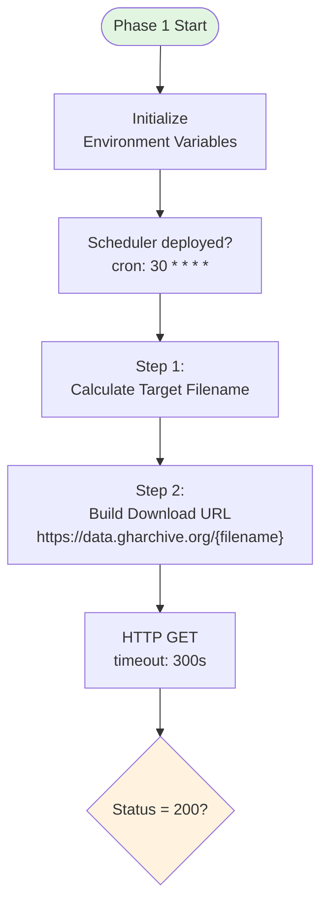

# Mermaid Diagram Rendering Issues

This document captures common issues encountered when rendering Mermaid diagrams and their solutions.

## Error: "Parse error... Expecting 'SQE', 'DOUBLECIRCLEEND'..."

### Root Cause
This error occurs when **special characters** (parentheses `()`, brackets `[]`, braces `{}`, symbols like `&`, `#`, `?`) are used in node text without proper quoting. The Mermaid parser tries to interpret these characters as part of the graph structure rather than literal text.

### Example Error
```
Parse error on line 17:
.../data.gharchive.org/{filename}]    BuildURL
-----------------------^
Expecting 'SQE', 'DOUBLECIRCLEEND', 'PE', '-)', 'STADIUMEND', 'SUBROUTINEEND', 'PIPE', 'CYLINDEREND', 'DIAMOND_STOP', 'TAGEND', 'TRAPEND', 'INVTRAPEND', 'UNICODE_TEXT', 'TEXT', 'TAGSTART', got 'DIAMOND_START'
```

### Solution: Quote Node Text with Double Quotes

When node labels contain special characters, wrap the entire text in double quotes:

```mermaid
# ❌ WRONG - causes parse error
BuildURL[Step 2: Build URL https://data.gharchive.org/{filename}]
Storage[Cloud Storage Bucket: {project}-dev-github-archive-landing]

# ✅ CORRECT
BuildURL["Step 2: Build URL https://data.gharchive.org/{filename}"]
Storage["Cloud Storage Bucket: {project}-dev-github-archive-landing"]
```

## Line Break Syntax

### Issue
Using HTML-style `<br/>` instead of Mermaid's `<br>`.

```mermaid
# ❌ WRONG
Node1[Text<br/>More text]

# ✅ CORRECT
Node1[Text<br>More text]
```

## Subgraph Not Supported in flowchart

### Issue
Using `subgraph` inside `flowchart` diagrams causes errors. `subgraph` is only supported in `graph` or `stateDiagram`.

```mermaid
# ❌ WRONG - subgraph not supported in flowchart
flowchart TD
    subgraph Group
        A --> B
    end

# ✅ CORRECT - use graph instead
graph TD
    subgraph Group
        A --> B
    end
```

## Common Special Characters Requiring Quotes

| Character | Example | Solution |
|-----------|---------|----------|
| `{` `}` | `{filename}` | `["Text {filename}"]` |
| `(` `)` | `(project)` | `["Text (project)"]` |
| `?` | `Status = 200?` | `{Status = 200?}` (diamond node) |
| `:` in URL | `https://...` | `["URL text"]` |

## Diamond Decision Nodes

Diamond shapes use single braces `{}` and don't require quoting:

```mermaid
CheckStatus{Status = 200?}
Ready{Ready to Start?}
```

## Complete Working Example



## Files Fixed (2026-03-05)

The following diagram files in `design/github_archive/phase1_ingestion/diagrams/` were fixed:

1. **ingestion_01_main_flow.md** - Added quotes around node with `{filename}`, changed `flowchart TD` to `graph TD`
2. **ingestion_02_entry_conditions.md** - Fixed `<br/>` to `<br>`
3. **ingestion_03_exit_conditions.md** - Added quotes around node with `{filename}`, fixed `<br/>` to `<br>`
4. **ingestion_06_components.md** - Added quotes around node with `{project}`, fixed `<br/>` to `<br>`
5. **ingestion_07_improvements.md** - Fixed `<br/>` to `<br>`

Note: `ingestion_04_failure_scenarios.md` and `ingestion_05_sequence_diagram.md` did not require changes for curly braces (they had none in problematic positions).

## Validation Tools

- [Mermaid Live Editor](https://mermaid.live) - Test diagrams before committing
- Always test complex diagrams with special characters

## References

- [Mermaid图表语法错误解析](https://m.php.cn/faq/1691408.html)
- [Mermaid 图语法错误：如何正确处理包含特殊字符的节点名称](https://m.php.cn/faq/1688865.html)
- [Mermaid Flowchart Documentation](https://mermaid.js.org/syntax/flowchart.html)
